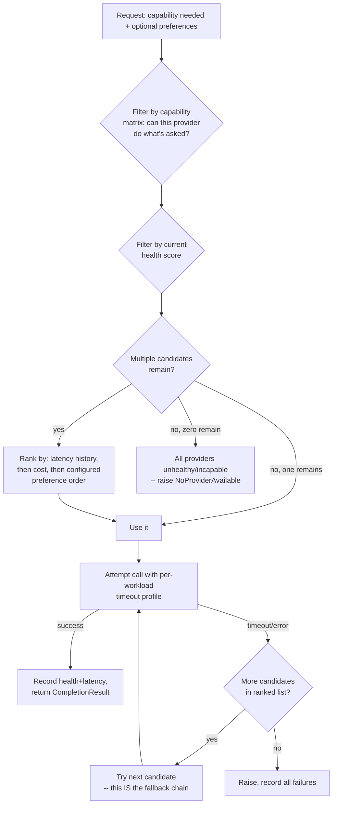

# AI Router — Design Specification

**Part of:** `DESIGN_SPEC_v14_AUTONOMOUS_CORE.md`. Documentation only.
**Replaces/generalizes:** `baka_brain.py`'s hardcoded NVIDIA NIM client,
its `MODEL_MAIN`/`MODEL_FAST`/`MODEL_THINK`/`MODEL_VISION`/`MODEL_IMAGE`/
`MODEL_VIDEO` constants, and the fallback/timeout logic added in
`CHANGELOG.md`'s v13.3.1 (`_is_model_dead()`, MAIN→FAST fallback) and
v13.3.2 (per-workload timeout profiles).

---

## Why this exists

`ENGINEERING_AUDIT.md` finding C4 already established the problem
precisely: `CHANGELOG.md`'s v11.1 entry claims BAKA's analytics are
"provider-independent... adding a new provider = adding entries to
`MODEL_COSTS`, no code changes" — but that's only true for
*cost-tracking metadata*. The actual client (`baka_brain.py`'s module-level
`client = OpenAI(base_url=NIM_BASE_URL, ...)`) is hardcoded to NVIDIA NIM
throughout every `call_*`/`generate_*` function. Meanwhile
`requirements.txt` already carries `anthropic==0.107.1` and the full
`google-ai-generativelanguage`/`google-api-core`/`google-auth` stack as
dependencies — neither is imported anywhere in the codebase. This is
strong, concrete evidence that multi-provider support was planned once and
never finished.

The cost of *not* finishing it has now materialized twice in production:
`CHANGELOG.md`'s v11.2 entries document `z-ai/glm-5.1` being EOL'd by
NVIDIA, its replacement `z-ai/glm-5.2` going DEGRADED almost immediately,
and the project moving to `meta/llama-3.3-70b-instruct` — and then
`AI_DIAGNOSTIC_REPORT.md` documents *that* model also going unresponsive,
requiring the v13.3.1/v13.3.2 hotfixes. Three incidents, same root cause:
one provider, no real alternative. The AI Router turns "swap `MODEL_MAIN`
and hope" into "route around a bad provider automatically."

## Provider interface

One canonical interface every provider adapter implements — deliberately
narrow, modeled on what `baka_brain.py`'s functions already return today
(a text string, or a tuple with latency/error info) so migrating the
NVIDIA adapter is a lift-and-shift, not a rewrite:

```python
class AIProvider(Protocol):
    name: str                        # "nvidia", "openai", "anthropic", "gemini", "ollama", "lmstudio"
    capabilities: ProviderCapabilities  # see Capability Matrix below

    async def complete(
        self,
        messages: list[Message],       # canonical internal format, translated
        model: str,                    # provider-specific model id
        max_tokens: int,
        temperature: float,
        timeout: float,                # per-call, same discipline v13.3.2 established
    ) -> CompletionResult:
        """Raises ProviderTimeoutError, ProviderUnavailableError, or
        ProviderError (base class) -- never a provider-SDK-specific
        exception type. This is the single most important property of
        the interface: v13.3.1's isinstance(exc, APITimeoutError) fix
        only worked because there was exactly one SDK's exception
        hierarchy to check. A multi-provider router MUST normalize
        exceptions at the adapter boundary, or every consumer of the
        router has to know every provider's exception types."""

    async def vision(self, image, prompt: str, ...) -> CompletionResult: ...
    async def generate_image(self, prompt: str, ...) -> MediaResult: ...
    async def generate_video(self, prompt_or_image, ...) -> MediaResult: ...

class CompletionResult:
    text: str
    latency_ms: int
    prompt_tokens: int
    completion_tokens: int
    estimated_cost_usd: float | None
    provider: str
    model: str
    fallback_used: bool
```

Each adapter (NVIDIA, OpenAI, Anthropic, Gemini, Ollama, LM Studio) owns
translating this canonical shape to/from its own SDK's format — e.g. the
Anthropic adapter translates the canonical `messages` list into Anthropic's
`system`+`messages` split, since Anthropic's API doesn't use OpenAI-style
inline system messages. This is the same shape of translation
`baka_brain.py` already does implicitly by using an OpenAI-compatible
client against NVIDIA NIM (NVIDIA's NIM endpoints are themselves an
OpenAI-API-compatible wrapper) — the Router makes that translation layer
explicit and repeats it per provider instead of relying on API compatibility.

## Provider selection



Selection is a **pure function of (capability requirement, current health
scores, configured preferences) → ranked provider list**, computed
in-process with no network call — satisfying NFR-3 in the master spec
(routing must not add a network round-trip of its own).

## Capability matrix

| Capability | NVIDIA (today) | OpenAI | Anthropic | Gemini | Ollama (local) | LM Studio (local) |
|---|---|---|---|---|---|---|
| Text completion | ✅ (`MODEL_MAIN`/`FAST`/`THINK`) | ✅ | ✅ | ✅ | ✅ (model-dependent) | ✅ (model-dependent) |
| Vision | ✅ (`MODEL_VISION`) | ✅ | ✅ | ✅ | Model-dependent | Model-dependent |
| Image generation | ✅ (`MODEL_IMAGE`, FLUX) | ✅ (DALL·E) | ❌ | ✅ (Imagen) | Model-dependent | Model-dependent |
| Video generation | ✅ (`MODEL_VIDEO`, SVD) | ❌ | ❌ | Limited | ❌ (typically) | ❌ (typically) |
| Streaming | Not currently used by BAKA (§ note below) | ✅ | ✅ | ✅ | ✅ | ✅ |
| Offline / no network | ❌ | ❌ | ❌ | ❌ | ✅ | ✅ |

The matrix is consulted at selection time (the "Filter by capability"
step above) — a video-generation request is never routed to Anthropic,
full stop, regardless of health/cost ranking. This is a static table,
maintained alongside each adapter, not derived at runtime.

**Note on streaming:** `baka_brain.py` never sets `stream=True` today
(confirmed during `AI_DIAGNOSTIC_REPORT.md`'s HTTP configuration review) —
the Router's v14 scope preserves this (non-streaming throughout), since
introducing streaming responses would touch `notification_service.py`'s
message-editing behavior, which is out of this design's scope (§3
Non-Goals). Streaming is a plausible future extension (§Future
Extensibility), not part of v14.

## Latency routing

Builds directly on infrastructure that already exists but is currently
non-functional: `performance_tracker.py`'s latency-percentile tracking and
`model_metrics.py`'s per-model health detection are real, already-written
code — `DEBUGGING.md`'s Known Issues section documents that they're
unreachable today only because the `analytics` package they depend on was
never assembled into an importable package. The AI Router's latency
routing is this same logic, generalized from "per-model" to "per-provider,"
consuming real p50/p95 latency data once the `analytics` package fix
(master spec §11 Stage 0) lands. Until that prerequisite is done, latency
routing degrades to "use configured preference order" — a safe, explicit
fallback rather than routing on fabricated data.

## Health scoring

A per-provider score derived from a rolling window of recent call outcomes
— **explicitly not** a new invention: the master spec's mission brief
lists "Do NOT add health scoring" for the *hotfix* sprints that preceded
this one, because health scoring is architecture-level work, correctly
deferred to here. Score inputs:

- Recent success/failure ratio (windowed, e.g. last 20 calls)
- Recent latency relative to that provider's own historical baseline
  (catches "degraded but not fully down" — exactly the `z-ai/glm-5.2`
  DEGRADED-HTTP-400 scenario from `CHANGELOG.md`'s v11.2 entry, which
  today's string-matching `_is_model_dead()` check only partially catches)
- A hard circuit-breaker: N consecutive failures marks a provider
  unavailable for a cooldown period, avoiding wasting a timeout budget on
  a provider that's confirmed down (directly generalizing the
  `AI_DIAGNOSTIC_REPORT.md`-documented pattern of `MODEL_MAIN` being
  unresponsive for an extended period, not just one bad request)

## Fallback chain

Directly generalizes v13.3.1's MAIN→FAST logic from "two models, one
provider" to "N providers, ranked":

1. Try the top-ranked healthy, capable provider with its per-workload
   timeout (`AI_ROUTER.md`'s timeout profiles inherit the four tiers
   v13.3.2 already established — fast chat/normal reasoning/long
   reasoning/vision — as *per-workload*, not per-provider, properties;
   every provider adapter receives the same tier-appropriate timeout for
   a given request type).
2. On a normalized `ProviderTimeoutError`/`ProviderUnavailableError`
   (never a raw SDK exception — see Provider Interface above), mark that
   provider's health down and immediately try the next-ranked candidate —
   no retry against the same provider beyond what v13.3.1's "stop
   retrying a confirmed-dead model" principle already established.
3. Exhausting all capable, configured providers raises
   `NoProviderAvailable` — at which point the Offline Engine (or the
   calling code) is responsible for a user-facing message, exactly as
   `call_nvidia()`'s final `raise last_exc` is today (unsuppressed, not
   silently swallowed).

## Retry strategy

Per-provider retry count and inter-attempt delay remain configurable per
adapter (NVIDIA's adapter can keep the existing 3-attempts/2s-sleep
policy verbatim), but the Router's own cross-provider fallback does
**not** retry a provider it just marked unhealthy — this mirrors the
v13.3.1 design decision precisely (stop retrying a model that's confirmed
dead; move on immediately) applied one level up the stack.

## Cost awareness

`token_counter.py` already implements per-model cost estimation for 15
models (`docs/ai_system.md`) — currently unreachable for the same
`analytics`-package reason as latency tracking. The Router's cost
awareness is this existing logic, extended with entries for
OpenAI/Anthropic/Gemini's real pricing (their current model IDs, not the
stale ones `docs/ai_system.md`'s Known Issues section already flags for
NVIDIA's models). Cost is a **tie-breaker**, not a primary ranking signal
— capability and health are filtered first; only when multiple healthy,
capable providers remain does cost influence the final ranking, and only
if the deployment opts in to cost-aware routing (a configuration flag, off
by default, since optimizing for cost over the currently-fastest/healthiest
option is a deliberate tradeoff a deployer should choose, not an implicit
default).

## Why NOT a bigger abstraction

Two things this design deliberately avoids, named explicitly because
they were tempting and explicitly out of scope per the mission brief:

- **No ML-based provider selection.** Health scoring uses simple windowed
  statistics, not a learned model — consistent with `INTENT_ENGINE.md`'s
  ADR-002 reasoning for choosing rule-based classification over ML there
  too. A router that's hard to reason about defeats the purpose of
  building it in the first place (the whole point is that when something
  goes wrong, an engineer can look at the health score and understand
  why a provider was or wasn't chosen).
- **No dynamic runtime provider discovery.** Providers are configured
  (a fixed, deployer-edited list of enabled adapters + credentials), not
  auto-discovered. This keeps the Router's behavior predictable and keeps
  credential management out of this design's scope.

## Future extensibility

- **Streaming responses** — the Provider Interface's `complete()` could
  grow a `stream: bool` parameter later without breaking existing callers,
  once `notification_service.py`'s message-editing pacing is designed to
  support incremental updates (out of scope for v14, noted here as the
  concrete blocker if it's ever prioritized).
- **Per-user provider preference** — "this user brings their own OpenAI
  key" is a natural extension of the configured-provider-list model; the
  Router's selection function already takes "preferences" as an input.
- **Local-model-first routing** — once Ollama/LM Studio adapters exist, a
  deployment could configure them as the top-ranked (cheapest, most
  private) provider with cloud providers as the fallback chain — the
  Router doesn't need to know or care that a provider is "local," it's
  just another entry in the capability matrix with `offline: true`.
