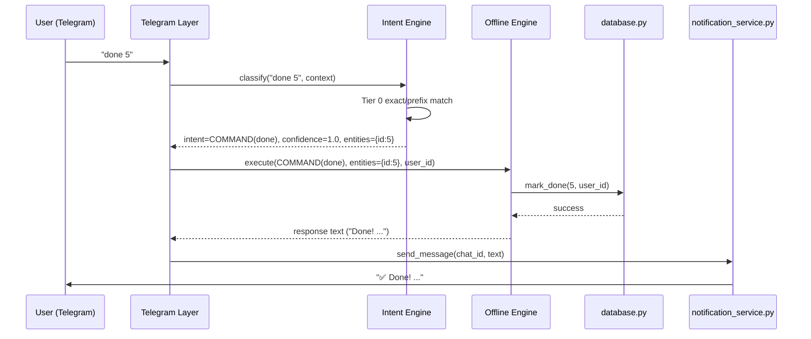
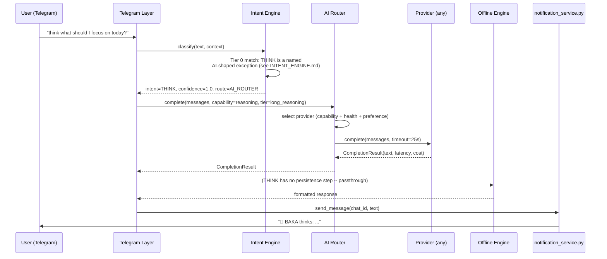
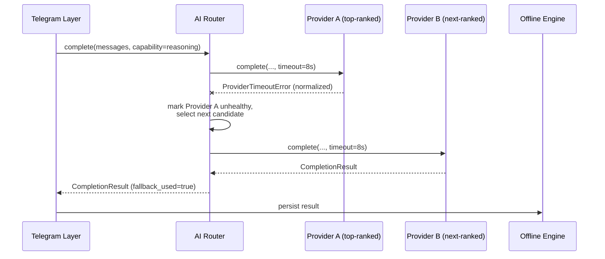

# Command Pipeline — Design Specification

**Part of:** `DESIGN_SPEC_v14_AUTONOMOUS_CORE.md`. Documentation only.
**Documents:** the complete request lifecycle across the Intent Engine,
Offline Engine, and AI Router, replacing today's single-function
`handle_message()`/`handle_callback()` flow in `main.py`.

---

## Full lifecycle

```
Telegram Update
    ↓
[1] Ingress — update type detection (message / callback_query / photo)
    ↓
[2] Intent Engine — classify(text, context) -> ClassificationResult
    ↓
[3] Validation — is the classified intent well-formed?
    (required entities present for this intent, or explicitly missing
     and routed to CLARIFY)
    ↓
[4] Permission — admin-only? plugin-scoped? (mirrors today's admin_only
    decorator and database.py's user_id scoping)
    ↓
[5] Execution
      ├── Offline Engine (no AI needed)
      └── AI Router → structured result → Offline Engine persists it
    ↓
[6] Response — fmt.py formatting (unchanged), sent via
    notification_service.py (unchanged — TelegramSender's pacing/retry
    applies exactly as today)
```

Every stage is a pure, testable unit with a narrow input/output contract —
directly addressing NFR-6 in the master spec (offline-testable without
mocking Telegram). Stage boundaries are chosen so each one can be unit
tested the way `tests/test_date_parser.py`/`tests/test_scheduler.py`/
`tests/test_database.py` already test today's equivalent logic.

## Sequence diagram — offline-eligible command (the common case)



## Sequence diagram — AI-eligible command (`/think`)



## Sequence diagram — AI-eligible command with a fallback (provider degraded)



This third diagram is the direct generalization of v13.3.1's
MAIN→FAST fallback (single provider, two models) into the AI Router's
N-provider fallback chain (`AI_ROUTER.md` §Fallback chain) — structurally
identical, one more layer of indirection.

## Validation stage detail

"Well-formed" is intent-specific, defined by the Intent Engine's own
per-intent entity requirements (`INTENT_ENGINE.md`), checked here rather
than duplicated per-handler the way `main.py` currently re-validates
inconsistently per command:

- A `TASK` intent requires at minimum a title; missing date/time routes to
  `CLARIFY` (today's `gathering` state), not a validation failure.
- A `COMMAND(done)` intent requires a numeric id; a non-numeric or missing
  id is a validation failure — today's equivalent is the `try/except
  (ValueError, TypeError)` pattern scattered through `main.py`'s handlers
  (`ARCHITECTURE.md`'s note on `handle_callback`'s hardened `int()`
  parsing) — v14 centralizes this instead of repeating it per handler.
- A destructive `COMMAND` (admin resets) additionally requires the
  existing typed-confirmation-phrase check — validation does not weaken
  any existing safety gate, it relocates where the check happens.

## Permission stage detail

Two checks, evaluated in order:

1. **Admin gate** — if the matched command is `admin_only` (built-in or
   plugin-declared, `PLUGIN_SYSTEM.md`), check against
   `admin_id.txt`/`is_admin()` exactly as today, with the same silent
   "Unknown command" denial (`docs/telegram_integration.md`) — this is a
   deliberate behavior preservation, not a redesign.
2. **Scope gate** — every entity referencing a database row (a task id,
   goal id, material id) is checked for `user_id` ownership before
   execution, not just at the query level — this makes explicit and
   front-loads a check that today happens implicitly, inside each
   `database.py` function's `WHERE user_id=?` clause. Front-loading it
   lets the pipeline return a clean "not found" response before ever
   reaching the Offline Engine, rather than each handler independently
   interpreting an empty query result.

## Response stage detail

Unchanged from today in every respect that matters: `fmt.py`'s
`esc()`/`b()`/`i()`/`task_line()`/`confirm_box()` helpers remain the
formatting layer, Telegram HTML remains the format (not Markdown — a
decision `CHANGELOG.md`'s v7.1 entry already made for good, documented
reasons), and `notification_service.py`'s `TelegramSender` remains the
delivery mechanism with its existing pacing/retry/edit-safety behavior
(`docs/telegram_integration.md`). The Command Pipeline's only relationship
to this stage is that it's always the *last* stage — nothing bypasses it,
including AI Router results and plugin-originated responses.
