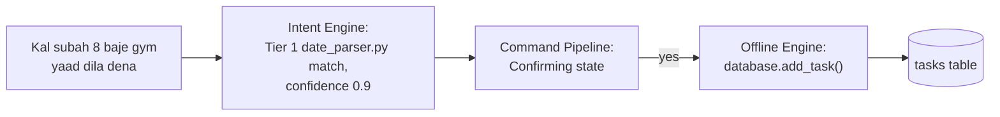
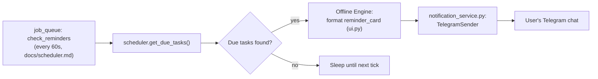
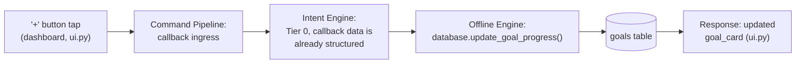
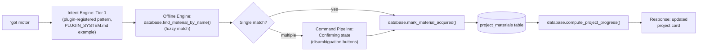
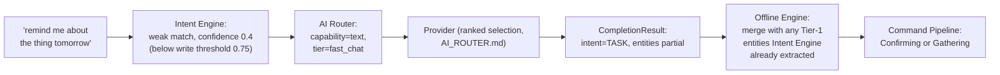
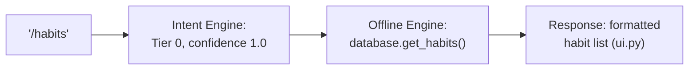
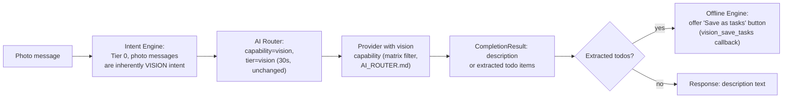

# Data Flow — Design Specification

**Part of:** `DESIGN_SPEC_v14_AUTONOMOUS_CORE.md`. Documentation only.
**Documents:** the 8 flows named in this sprint's brief, each traced
through the v14 architecture and cross-referenced against the exact
existing `database.py`/`scheduler.py` functions each one uses today, since
none of this data layer changes (`DESIGN_SPEC_v14_AUTONOMOUS_CORE.md` §3
Non-Goals, §9 "unchanged, reused as-is").

---

## 1. Reminder creation



Deterministic end to end — the Hindi/Hinglish date phrasing resolves via
`date_parser.py`'s existing regex rules (now a Tier-1 Intent Engine rule
source, `INTENT_ENGINE.md`), never touching the AI Router. This is
already true today; v14 just makes it structurally guaranteed rather than
a side effect of which handler happened to get written first.

## 2. Reminder execution



Entirely scheduler-initiated, no Intent Engine involvement (there's no
incoming message to classify) — the Offline Engine is invoked directly by
the job callback, exactly as `main.py`'s `check_reminders` job calls into
handler-equivalent logic today. `notification_service.py`'s pacing
(v13.0) applies unchanged.

## 3. Goal progress



A callback query's `data` payload (e.g. `dash:goalplus:12`) is already
fully structured — the Intent Engine's role here is trivial (Tier 0,
confidence 1.0 by construction, no pattern matching needed), which is why
`COMMAND_PIPELINE.md`'s ingress stage treats callback queries and typed
commands uniformly rather than as separate pipelines.

## 4. Project updates



Traces `docs/dashboard.md`'s and `docs/database.md`'s existing
`find_material_by_name()`/`mark_material_acquired()`/
`compute_project_progress()` functions directly — the Projects feature is
this design's proof-of-concept plugin (ADR-004) precisely because its data
flow, as this diagram shows, is already fully self-contained and offline.

## 5. Habit completion

```mermaid
flowchart LR
    A["'✅ Done' tap on a habit\nreminder"] --> B["Intent Engine: Tier 0\n(callback, structured)"]
    B --> C["Offline Engine:\ndatabase.log_habit_completion()"]
    C --> D[(habit_log table,\nUNIQUE(habit_id, log_date))]
    D --> E["streak computed\n(same function, database.py)"]
    E --> F["Response: '🔥 Streak: N days!'"]
```

`log_habit_completion()` (`docs/database.md`) already returns the
computed streak in the same call — v14 doesn't add a separate streak-
calculation step, it reuses the existing atomic function exactly.

## 6. AI request (ambiguous natural language)



Note the merge step: even when AI is invoked, any entities the Intent
Engine's deterministic Tier-1 rules already resolved (e.g. "tomorrow" is
unambiguous regardless of how vague the rest of the message is) are
preserved and merged with the AI's extraction — this directly continues
today's documented pattern where `date_parser.py`'s output is trusted
over the AI's own date/time guess for exactly the phrasings it's known to
get right (`ARCHITECTURE.md`'s message-lifecycle section).

## 7. Offline request (the common case)



The majority-case flow (`OFFLINE_ENGINE.md`'s inventory) — no AI Router
involvement, no state transition, single round trip.

## 8. Vision request



The capability-matrix filter (`AI_ROUTER.md`) is load-bearing here: a
photo message can only be routed to a provider whose capability matrix
marks `vision: true` — today this is implicit (there's only one provider,
NVIDIA, and `ENABLE_VISION` is a global on/off flag,
`docs/ai_system.md`); v14 makes the capability check per-request and
per-provider, which matters the moment a second provider without vision
support (e.g. a text-only local Ollama model) is added to the router.

## Cross-cutting observation

Every flow above passes through the Offline Engine exactly once for its
actual database write (or not at all, for read-only/AI-passthrough flows
like `/think`) — there is no flow in this document where the AI Router
writes directly to `database.py`. This is the single invariant the whole
v14 design is built around (`DESIGN_SPEC_v14_AUTONOMOUS_CORE.md` §7,
ADR-003), and tracing all 8 required examples through it here is this
document's way of demonstrating that the invariant actually holds for
every real flow this bot has, not just the ones that were convenient to
design around.
