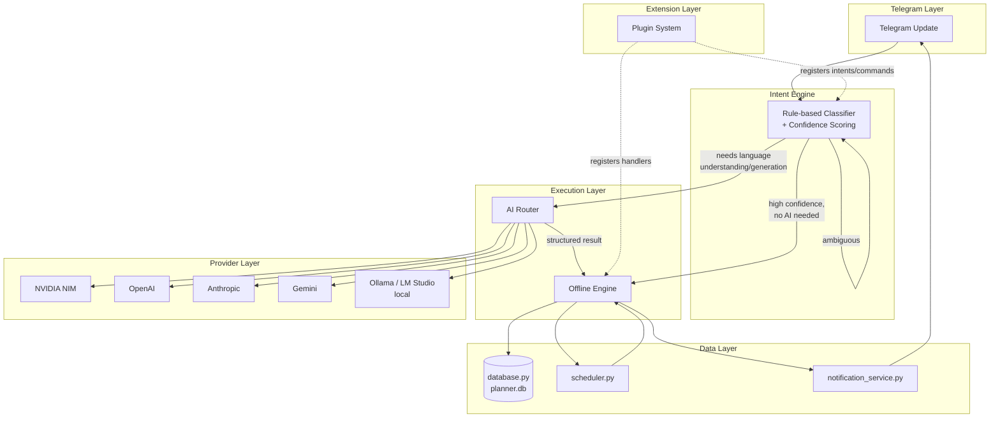

# BAKA v14 — Autonomous Core: Master Design Specification

**Status:** Proposed. Documentation only — nothing in this document has been
implemented. No production code was written or modified to produce it.
**Audience:** an engineer who has not seen this codebase, tasked with
building v14 from this document and its companions (see §13, "Documentation
tree").
**Companion documents:** `INTENT_ENGINE.md`, `OFFLINE_ENGINE.md`,
`AI_ROUTER.md`, `PLUGIN_SYSTEM.md`, `COMMAND_PIPELINE.md`,
`STATE_MACHINE.md`, `DATA_FLOW.md`, `docs/adr/*.md`.

---

## 1. Vision

BAKA today is, structurally, `Telegram → AI`: nearly every free-text
message that isn't an exact slash command or a hand-matched keyword phrase
goes to a single LLM provider (NVIDIA NIM) for intent classification before
anything happens. This has worked, but it means the bot's core
responsiveness, reliability, and cost are all hostage to one external
vendor's API health — a dependency that has already caused two
production incidents this project has had to fix reactively (`CHANGELOG.md`
v11.2, v13.3.1, v13.3.2: two full model swaps and two timeout/fallback
hotfixes, all for the same underlying reason — NVIDIA NIM model
instability).

v14's vision is to invert that default: **BAKA should understand and act on
the large majority of what a user says without calling any AI provider at
all**, reserving AI for the specific class of requests that genuinely need
open-ended language understanding or generation (ambiguous natural-language
task creation, `/think`, planning, vision, image/video). When AI *is*
needed, BAKA should not be tied to one vendor — it should route across
whichever provider is healthy, fast, and appropriate for the request, with
the same graceful-degradation instinct v13.3.1/v13.3.2 already proved out
for a single provider, generalized across many.

This is the `Telegram → Intent Engine → Offline Engine + AI Router`
architecture named in this sprint's mission brief.

## 2. Goals

1. **Deterministic-first execution.** A new Intent Engine (`INTENT_ENGINE.md`)
   classifies every incoming message with a confidence score *before*
   deciding whether AI is needed at all — formalizing and extending what
   `main.py`'s slashless-command table and `date_parser.py`'s deterministic
   overrides already do today, informally and only partially.
2. **AI as an escalation, not a default.** The Offline Engine
   (`OFFLINE_ENGINE.md`) executes every command that doesn't require open-
   ended language understanding directly against `database.py`/`scheduler.py`
   — most of BAKA's command surface already works this way (see
   `API.md`'s command table: `/list`, `/today`, `/done`, `/habits`,
   `/goals`, `/settings`, and dozens more never call an LLM today); v14
   makes this the *architecturally guaranteed* default rather than an
   accident of which handlers happen to not call `baka_brain.py`.
3. **Provider independence, for real this time.** `ENGINEERING_AUDIT.md`
   finding C4 already flagged that BAKA's "provider-independent" claim
   (`CHANGELOG.md` v11.1) was cost-metadata-only — the actual client is
   hardcoded to NVIDIA NIM throughout `baka_brain.py`. `requirements.txt`
   already carries unused `anthropic` and `google-ai-generativelanguage`
   dependencies, evidence that multi-provider support was intended once
   before and never finished. The AI Router (`AI_ROUTER.md`) finishes it.
4. **Extensibility without touching `main.py`.** `main.py` is a confirmed
   5,300+ line, ~90-handler god-file (`ENGINEERING_AUDIT.md` finding J1).
   Every new command today means editing that one file. The Plugin System
   (`PLUGIN_SYSTEM.md`) lets new capability ship as an installable unit.
5. **Preserve everything that already works.** Reminders, habits, goals,
   projects, the scheduler, quiet hours, the admin lock, Telegram delivery
   pacing — none of this is broken, none of it needs redesigning. v14 is
   additive infrastructure around the existing data layer, not a rewrite of
   it.

## 3. Non-Goals

Explicitly out of scope for v14, to keep the design honest about its own
size:

- **Not a rewrite of `database.py`'s schema.** The Intent Engine, Offline
  Engine, and AI Router all read/write through the existing `database.py`
  functions and the existing 13-table schema (`docs/database.md`). Schema
  evolution (if any) is a separate, future concern.
- **Not a UI/UX redesign.** Telegram remains the only supported client.
  No web dashboard, no mobile app — that's explicitly listed as a "not yet"
  in `PROJECT.md` and stays that way here.
- **Not a multi-tenant/hosted-SaaS redesign.** `ENGINEERING_AUDIT.md`'s
  ARCH-6 already notes the admin model is deliberately single-owner; v14
  doesn't change that. The AI Router's multi-provider design incidentally
  makes future multi-tenancy easier, but building it is not a v14 goal.
- **Not a local-LLM shipping commitment.** `OFFLINE_ENGINE.md` designs the
  *seam* for a future local model (e.g. via Ollama/LM Studio, already named
  as target providers in `AI_ROUTER.md`), but v14 does not commit to
  actually bundling or running one.
- **Not a fix for any specific currently-open bug.** `ENGINEERING_AUDIT.md`'s
  remaining open findings (F3 Markdown formatting, E4's connection-pooling
  half, E8's cascade-delete comment, D3's recurring-reminder catch-up) are
  unrelated to this architecture and are not addressed here.

## 4. Functional Requirements

| ID | Requirement |
|---|---|
| FR-1 | Every incoming Telegram update must be classified by the Intent Engine into an intent + confidence score before any handler-equivalent logic runs. |
| FR-2 | Commands classified with sufficient confidence and no AI-dependent field must execute entirely through the Offline Engine, with zero network calls to any AI provider. |
| FR-3 | Requests that genuinely require language understanding or generation must be dispatched through the AI Router, which selects a provider based on capability, health, and (optionally) cost — not a hardcoded single vendor. |
| FR-4 | The AI Router must support at minimum the providers named in `AI_ROUTER.md` (NVIDIA, OpenAI, Anthropic, Gemini, Ollama, LM Studio) behind one interface, addable without modifying call sites. |
| FR-5 | New commands and capabilities must be installable as plugins (`PLUGIN_SYSTEM.md`) without editing the Intent Engine, Offline Engine, or AI Router core. |
| FR-6 | The user-facing conversation state machine (`STATE_MACHINE.md`) must support at least the flows already live today (gathering, confirming, editing) plus the new flows this document introduces (plugin-driven flows, AI-router-mediated reasoning). |
| FR-7 | Every data flow that currently exists (reminders, habits, goals, projects) must continue to function identically from the user's perspective — v14 is additive, not a behavior change to existing commands. |
| FR-8 | The system must degrade gracefully: an AI provider outage must never prevent an Offline-Engine-eligible command from working. |

## 5. Non-Functional Requirements

| ID | Requirement | Rationale |
|---|---|---|
| NFR-1 | Offline-Engine command latency: comparable to today's non-AI commands (sub-100ms typical, dominated by SQLite query time — see `docs/database.md`'s benchmark data). | These commands don't touch AI today; v14 must not regress them. |
| NFR-2 | Intent Engine classification latency: single-digit milliseconds for the deterministic path (no network I/O). | It runs on *every* message, including ones that will still need AI — it must never itself become the bottleneck. |
| NFR-3 | AI Router provider selection: must not add more than one extra function call's worth of overhead over today's direct `baka_brain.py` call. | Routing logic must be data lookup, not another network round-trip. |
| NFR-4 | Plugin loading must not increase cold-start time by more than a small, bounded amount per plugin. | `main.py`'s current startup is already meaningfully sequential (§ARCHITECTURE.md's module map); plugins must not make this worse unbounded. |
| NFR-5 | All new infrastructure must respect the project's existing conventions: IST-aware datetime handling (`CLAUDE.md`), Telegram HTML formatting via `fmt.py`, additive/idempotent migrations, the single-instance lock (`instance_lock.py`). | Consistency with `CLAUDE.md`'s documented conventions, unchanged by this sprint. |
| NFR-6 | The system must remain testable offline, extending the precedent set by the 211-test suite (`tests/`, `TESTING.md`) — the Intent Engine and Offline Engine in particular should be substantially unit-testable without mocking Telegram or any AI provider. | The project's single biggest historical reliability gap (`ENGINEERING_AUDIT.md` Technical Debt) was zero automated tests; v14 must not regress that discipline. |

## 6. Architecture Overview



**Reading this diagram:** the Intent Engine is the single entry point for
every update (replacing today's ad-hoc "slashless table, then keyword
shortcuts, then AI fallback" logic scattered through `handle_message()`).
It always runs first and is always deterministic — it never itself calls
an AI provider. It hands off to exactly one of: the Offline Engine
(command executes now, no AI), the AI Router (language understanding or
generation needed first), or back to itself (state machine transition,
e.g. asking a clarifying question). The AI Router's job ends the moment it
returns a structured result; execution against the data layer always goes
through the Offline Engine, so there is exactly one code path that writes
to `planner.db`, regardless of whether AI was involved in deciding what to
write. Plugins extend the Intent Engine's rule set and the Offline Engine's
command handlers without modifying either's core.

## 7. Data Flow (summary — see `DATA_FLOW.md` for full detail)

At a high level, every flow follows one of two shapes:

**Offline-eligible** (majority of commands today, per `OFFLINE_ENGINE.md`'s
inventory):
```
Telegram → Intent Engine (deterministic match, confidence ≈ 1.0)
         → Offline Engine → database.py / scheduler.py
         → notification_service.py → Telegram
```

**AI-eligible** (ambiguous natural language, `/think`, planning, vision,
image/video):
```
Telegram → Intent Engine (low/no deterministic match)
         → AI Router → [selected provider]
         → structured result → Offline Engine (persists it)
         → notification_service.py → Telegram
```

The key structural change from today: in the current codebase, `baka_brain.py`
both classifies intent *and* often directly triggers side effects in the
same call (`get_baka_response()`'s JSON result is interpreted and acted on
by `main.py` inline). In v14, the AI Router **only ever returns structured
data** — it never writes to the database itself. This is deliberate (see
ADR-003) and closes a real, if narrow, risk surface: today, a hallucinated
or malformed AI response is trusted by whichever `main.py` branch happens
to consume it, with per-branch, inconsistent validation. Centralizing
writes in the Offline Engine gives v14 exactly one place to validate AI
output before it touches data.

## 8. Execution Flow (summary — see `COMMAND_PIPELINE.md` for full detail)

```
1. Telegram Update arrives
2. Intent Engine classifies (deterministic rules, confidence score)
3. Validation (is the classified intent well-formed? are required fields present?)
4. Permission check (admin-only? plugin-scoped?)
5. Execution:
     a. Offline Engine, if no AI needed, OR
     b. AI Router → structured result → Offline Engine persists it
6. Response formatted (fmt.py conventions, unchanged) and sent via
   notification_service.py (unchanged — TelegramSender's pacing/retry
   behavior applies exactly as it does today)
```

## 9. Module Responsibilities

| Module (new, this design) | Responsibility | Replaces / extends |
|---|---|---|
| Intent Engine | Classify every message; own the confidence-scored rule set; decide Offline vs AI Router vs re-prompt | `main.py`'s slashless-command table + keyword shortcuts + the deterministic parts of `date_parser.py`'s overrides |
| Offline Engine | Execute every non-AI-dependent command; own all writes to `database.py`; own all scheduler-triggered actions | The ~90 handler functions in `main.py` that don't call `baka_brain.py` today |
| AI Router | Select a provider per request based on capability/health/cost; return structured results only, never write data directly | `baka_brain.py`'s model-selection logic (`MODEL_MAIN`/`MODEL_FAST`/etc.) and the v13.3.1/v13.3.2 fallback/timeout logic, generalized across providers |
| Plugin System | Discover, register, permission-check, load/unload capability units | Nothing today — genuinely new |
| State Machine | Own conversation state transitions | `conversation_state.py`, extended (not replaced — see `STATE_MACHINE.md`) |

**Unchanged, reused as-is:** `database.py`, `scheduler.py`,
`notification_service.py`, `async_bridge.py`, `fmt.py`, `ui.py`,
`preferences.py`, `debug_system.py`, `date_parser.py` (its pure parsing
functions become one of the Intent Engine's rule sources, not replaced),
`instance_lock.py`. This is a deliberate design constraint (§3 Non-Goals,
NFR-5) — v14 is new layers around a proven data/delivery/scheduling core,
not a replacement of it.

## 10. Risk Analysis

| Risk | Likelihood | Impact | Mitigation |
|---|---|---|---|
| Intent Engine's deterministic rules misclassify a message the old AI-first approach would have gotten right, degrading NL understanding quality | Medium | Medium | Confidence thresholds are conservative by default (`INTENT_ENGINE.md` §Confidence Scoring); anything below threshold escalates to AI Router rather than guessing. Ship with a feature flag to compare Intent-Engine-classified vs. AI-classified outcomes before fully cutting over (see §11 Migration Strategy). |
| AI Router's multi-provider abstraction leaks provider-specific quirks (e.g. Anthropic's message format differs from OpenAI's) | Medium | Medium | Each provider adapter is responsible for translating to/from one canonical internal message format (`AI_ROUTER.md` §Provider Interface); this is the same shape of problem `baka_brain.py` already partially solved by wrapping NVIDIA NIM behind an OpenAI-compatible client. |
| Plugin System introduces a new attack surface (arbitrary code loaded at runtime) | Medium | High | Plugin permissions model (`PLUGIN_SYSTEM.md` §Permissions) mirrors the existing `admin_only` pattern; plugins declare required capabilities at manifest time, not runtime; no plugin can bypass `database.py`'s existing `user_id` scoping. |
| Migration introduces a regression in a currently-working flow (reminders, habits, projects) | Low-Medium | High | §3 Non-Goals explicitly forbids touching `database.py`'s schema or the scheduler; §11 Migration Strategy is incremental per-command-category, not a big-bang cutover; the existing 211-test suite (`tests/`) is the regression gate at every step. |
| Provider-cost blindness — routing to a more expensive provider without the user realizing | Low | Medium | `AI_ROUTER.md` §Cost Awareness requires every provider adapter to report cost via the same `token_counter.py`-style estimation already built (currently non-functional due to the missing `analytics` package, `DEBUGGING.md` Known Issues — v14's router depends on that being fixed first, see §11). |
| Scope creep — this is a large design; an implementer could reasonably try to build all of it at once | Medium | Medium | §14 Suggested Implementation Order is intentionally staged; each stage is independently shippable and testable. |

## 11. Migration Strategy

Incremental, category-by-category, never a big-bang rewrite:

1. **Stage 0 (prerequisite, not part of v14 itself):** fix the broken
   `analytics` package (`ENGINEERING_AUDIT.md`/`DEBUGGING.md`, already
   tracked) — the AI Router's health-scoring and cost-awareness features
   depend on real usage data, which currently doesn't get recorded at all.
2. **Stage 1 — Intent Engine, additive.** Build the Intent Engine to run
   *alongside* the existing `handle_message()` logic, classifying every
   message but not yet acting on the classification — purely for
   comparison logging. This validates the deterministic rule set against
   real traffic with zero user-visible risk.
3. **Stage 2 — Offline Engine for already-offline commands.** Move the
   commands that already don't call AI today (the majority — see
   `OFFLINE_ENGINE.md`'s inventory) to route through the Intent Engine +
   Offline Engine pair, one command category at a time (tasks, then
   habits, then goals/projects, then settings/admin). Each category is a
   separately shippable, separately testable change.
4. **Stage 3 — AI Router, NVIDIA-only.** Build the AI Router with only the
   NVIDIA adapter wired in (feature-parity with today), and cut
   `baka_brain.py`'s callers over to it. This validates the router
   abstraction itself before adding providers.
5. **Stage 4 — additional providers.** Add OpenAI, Anthropic, Gemini
   adapters (the SDKs are already project dependencies) one at a time,
   each gated behind the capability matrix (`AI_ROUTER.md`) so a provider
   without vision support, for instance, is never routed a vision request.
6. **Stage 5 — Plugin System.** Only after Stages 1-4 are stable: extract
   one real, existing feature (e.g. the Projects/materials-worklog
   feature, being the newest and most self-contained) into the plugin
   format as a proof of concept, then open the system for new plugins.

Each stage ships behind its own decision point; a stage can be paused
indefinitely without blocking the next, and every stage keeps
`tests/`'s 211 tests (plus new tests for the stage) green throughout.

## 12. Future Extensibility

This architecture is explicitly designed to make the following *easier*
later, without committing to them now:

- **Local LLM support** — `OFFLINE_ENGINE.md`'s "future local LLM
  integration" section and `AI_ROUTER.md`'s Ollama/LM Studio adapters give
  a local model a real seam to plug into, for cost or privacy-sensitive
  deployments.
- **Multi-tenant / hosted deployment** — the AI Router's per-request
  provider selection could later support per-user provider preference
  (e.g. "this user brings their own OpenAI key") without core changes.
- **Voice/other input channels** — since the Intent Engine's input is
  already an abstract "user said X," a future voice-transcription front
  end (already on `ROADMAP.md`'s backlog) could feed the same pipeline
  Telegram does today.
- **Third-party plugin ecosystem** — `PLUGIN_SYSTEM.md`'s versioning and
  permission model are designed with an eventual external-plugin-author
  audience in mind, even though v14 itself only needs first-party plugins.

## 13. Documentation Tree

```
DESIGN_SPEC_v14_AUTONOMOUS_CORE.md   (this document)
INTENT_ENGINE.md
OFFLINE_ENGINE.md
AI_ROUTER.md
PLUGIN_SYSTEM.md
COMMAND_PIPELINE.md
STATE_MACHINE.md
DATA_FLOW.md
docs/adr/
  ADR-001-offline-first-philosophy.md
  ADR-002-intent-engine.md
  ADR-003-ai-router.md
  ADR-004-plugin-system.md
  ADR-005-autonomous-core.md
```

## 14. Suggested Implementation Order

Matches §11's staging, restated as a flat checklist for planning purposes:

1. Fix the `analytics` package (prerequisite, tracked separately)
2. Intent Engine, shadow-mode (classify + log, don't act)
3. Offline Engine cutover, one command category at a time
4. AI Router, NVIDIA-only (feature parity)
5. AI Router, additional providers (OpenAI → Anthropic → Gemini → local)
6. Plugin System, proof of concept (Projects feature) → open for new plugins

## 15. Estimated Implementation Effort

Rough, relative sizing (S/M/L/XL), not calendar estimates — actual
duration depends on team size and how much of Stage 0's `analytics` fix is
already resolved:

| Stage | Size | Why |
|---|---|---|
| Intent Engine (shadow mode) | M | Mostly new rule-authoring, grounded in existing `date_parser.py`/slashless-table logic being formalized, not invented from scratch |
| Offline Engine cutover | L | Mechanical but touches most of `main.py`'s ~90 handlers; large surface area, low individual risk per handler |
| AI Router (NVIDIA-only) | M | Mostly restructuring `baka_brain.py`'s existing dispatch logic behind a cleaner interface |
| AI Router (additional providers) | L | Each provider adapter is its own small project; SDKs already present as dependencies reduces this from XL to L |
| Plugin System | L | Genuinely new subsystem; permission/lifecycle model needs careful design even though the proof-of-concept scope is small |

---

*Continue to `INTENT_ENGINE.md` for the deterministic parser design this
document depends on.*
