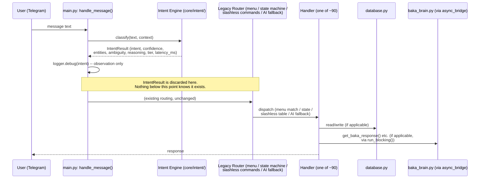
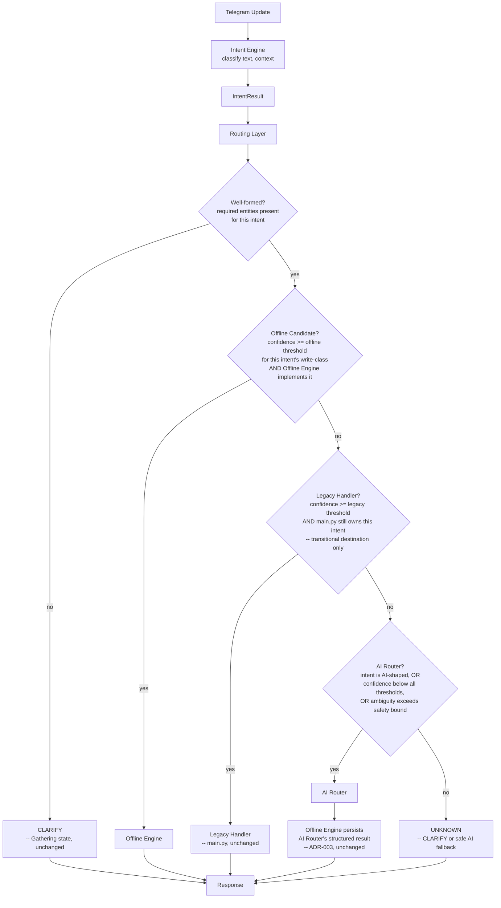

# DRG-001 — Design Review Gate 001: Intent-Aware Routing

**Informal designation:** "v14.1A" (this gate document's own identifier, assigned
by the task brief that requested it — **not** a claim that any v14.1 release has
shipped. `ROADMAP.md` deliberately avoids pre-assigning fixed version numbers to
unbuilt stages, per its own documented reasoning after a past collision; that
policy is unaffected by this document using "v14.1A" as its own name.)

**Status:** Proposed — design only. Zero application code changes accompany this
document. Nothing described here is implemented; `main.py`'s routing remains
exactly as shipped in v14.0 (Shadow Mode, `core/intent/`).

**Depends on:** `docs/adr/ADR-002-intent-engine.md` (Accepted, Stage 1 shipped),
`INTENT_ENGINE.md`, `OFFLINE_ENGINE.md`, `AI_ROUTER.md`, `COMMAND_PIPELINE.md`,
`STATE_MACHINE.md` (all Proposed/design-only).

**Relationship to existing design docs:** this gate does not introduce a
competing pipeline model. The "Routing Layer" defined here **is** a formal
contract around what `COMMAND_PIPELINE.md` already sketches as stages 3–5
(Validation / Permission / Execution dispatch) — this document exists because
`COMMAND_PIPELINE.md` described the pipeline's shape but never gave the
decision-making component its own name, ownership boundaries, failure-mode
analysis, or a concrete confidence policy grounded in the numbers Stage 1
actually shipped. Where this document and `COMMAND_PIPELINE.md` overlap, this
document is the more detailed, authoritative source for the Routing Layer
specifically; `COMMAND_PIPELINE.md`'s Ingress/Response stage descriptions are
unaffected and remain authoritative for those stages.

---

## Section 1 — Executive Summary

### Problem

BAKA's Intent Engine (`core/intent/`, v14.0 Stage 1) classifies every message
today — real confidence, real entities, real ambiguity score, sub-millisecond
latency (`CHANGELOG.md`'s v14.0 entry: mean 0.56ms) — but nothing acts on that
classification. `main.py`'s `handle_message()` still routes through its
original menu/state-machine/slashless-command/AI-fallback logic, unaware the
Intent Engine ran at all. The classification is real; its consequences are
zero. This is deliberate for Stage 1 (observation before action, `ADR-002`),
but it means BAKA today pays the Intent Engine's classification cost on every
message without recovering any of its benefit — no reduced AI calls, no
faster responses for high-confidence deterministic matches, no structured
routing telemetry.

### Motivation

Three things converge to make now the right time to design (not yet build)
the next step:

1. Stage 1 is stable and tested (251 tests, 100% coverage of `core/intent/`,
   zero production incidents since shipping — there is real classification
   data to design against, not a hypothetical).
2. `OFFLINE_ENGINE.md`/`AI_ROUTER.md`/`COMMAND_PIPELINE.md`/`STATE_MACHINE.md`
   already describe the destination components (Offline Engine, AI Router)
   and the state model those destinations interact with — but none of them
   own the *decision* of which destination a given `IntentResult` should
   reach. That decision currently has no home.
3. Building the decision layer without a design review risks repeating this
   project's own documented failure pattern: `date_parser.py`'s flat-list
   fragility (`ADR-002`'s "Alternatives considered") and `core/intent/`'s own
   near-miss ("good morning" misclassified during Stage 1's testing, `ADR-002`'s
   Implementation Note) both trace back to priority/ownership decisions made
   implicitly rather than reviewed explicitly. A Routing Layer is exactly
   this kind of priority-sensitive component, at higher stakes (it can select
   real execution paths, not just log a classification) — reviewing its
   design before writing code is the direct, deliberate countermeasure.

### Goals

- Define a **Routing Layer**: the component that consumes an `IntentResult`
  and a `ConversationContext` and decides among four destinations — Offline
  Engine, Legacy Handler (transitional), AI Router, or CLARIFY (re-prompt via
  the state machine) — without executing anything itself.
- Define the **contract** between the Intent Engine's existing output and
  the Routing Layer's own decision record, without modifying the already-shipped
  `IntentResult` dataclass.
- Define a **confidence policy** that extends (not replaces) `INTENT_ENGINE.md`'s
  already-approved per-intent-class thresholds (read-only 0.6 / reversible-write
  0.75 / destructive-write 0.95), adding the transitional "Legacy" destination
  those thresholds didn't originally need to distinguish.
- Define **failure modes** for every component this layer touches or depends on.
- Define a **migration path** from today's Shadow Mode to a state where the
  Routing Layer makes real decisions, staged so each step is independently
  reversible.

### Non-goals

- **Not implementing anything.** No `.py` file changes accompany this document.
- **Not redesigning the Intent Engine, Offline Engine, AI Router, or State
  Machine.** Their existing design docs and (for the Intent Engine) shipped
  code are inputs to this design, not subjects of it.
- **Not deciding the exact numeric confidence thresholds for every one of
  BAKA's ~90 commands.** Section 7's Routing Matrix establishes the
  *categories* and the *mechanism*; populating every row with a
  production-tuned number is implementation work for a later sprint, informed
  by real Shadow Mode classification logs this design doesn't yet have
  access to (Stage 1 has been live only since v14.0 — insufficient log
  history exists at design-review time to tune thresholds empirically).
- **Not building the Legacy→Offline migration itself** (moving individual
  `main.py` handlers into the Offline Engine) — that is `OFFLINE_ENGINE.md`'s
  and the master spec's Stage 2 proper; this document defines how the Routing
  Layer treats commands *during* that migration, not the migration's own
  handler-by-handler work.

---

## Section 2 — Current Flow

`main.py`'s `handle_message()`, as shipped in v14.0, Shadow Mode:



The critical property this diagram makes visible: **the Intent Engine's
output and the Legacy Router's decision are computed independently, from the
same input text, and never compared.** They may already agree most of the
time (Stage 1's rules were built by mirroring the Legacy Router's own tables —
`core/intent/rules.py`'s Tier 0) — but nothing today verifies that, and
nothing acts on it when they'd disagree.

---

## Section 3 — Target Flow



Four destinations, not two: `INTENT_ENGINE.md`'s original design (pre-Stage-1)
only needed to distinguish Offline vs. AI Router, because it was written
before Stage 1 shipped and before this gate's transitional reality became
concrete — most of `main.py`'s ~90 handlers are not yet ported to the
Offline Engine (`OFFLINE_ENGINE.md` describes what they *will* look like, not
what exists today). **Legacy Handler is this design's one genuinely new
destination**, added specifically to make the migration itself representable:
a high-confidence classification for a command the Offline Engine doesn't
implement yet should route to the existing, working `main.py` handler — not
be forced into a false choice between "pretend the Offline Engine already
covers it" and "treat a confident classification as if it were AI-shaped."

---

## Section 4 — Routing Layer Responsibilities

### What the Routing Layer owns

- **Destination selection** — applying the Confidence Policy (Section 6) and
  Routing Matrix (Section 7) to an `IntentResult` to pick exactly one of:
  Offline Engine, Legacy Handler, AI Router, CLARIFY.
- **The `RoutingDecision` record** (Section 5) — a new, distinct contract
  from `IntentResult`, produced by the Routing Layer, consumed by whichever
  destination is chosen and by observability (Section 9).
- **Trace ID generation** — one per Telegram update, propagated through
  every stage that logs about the same request.
- **Shallow well-formedness checks** — does this `IntentResult` have the
  entities the *routing decision itself* needs (e.g. a `DELETE_TASK` intent
  needs a `task_id` to know whether a destructive-write threshold applies at
  all). This is narrower than `COMMAND_PIPELINE.md`'s Validation stage, which
  additionally validates field *values* (a `task_id` that doesn't parse as an
  integer) — that deeper check remains Validation's job, invoked by whichever
  destination the Routing Layer selects, not duplicated here.
- **Fail-safe containment** — if the Intent Engine itself raises (mirroring
  the `try/except` already present in v14.0's Shadow Mode integration point),
  the Routing Layer's default is `Legacy Handler`, not `CLARIFY` or a crash —
  see Section 8, "Intent parser crash."

### What the Routing Layer does NOT own

- **Execution** — the Routing Layer never calls `database.py`, never calls
  `baka_brain.py`/the AI Router, never sends a Telegram reply. It returns a
  `RoutingDecision`; the caller (`COMMAND_PIPELINE.md`'s Execution stage)
  acts on it.
- **Deep field validation** — `COMMAND_PIPELINE.md`'s Validation stage,
  unchanged by this document.
- **Permission checks** (admin gate, `user_id` ownership scope) —
  `COMMAND_PIPELINE.md`'s Permission stage, unchanged.
- **Conversation state transitions** — `STATE_MACHINE.md` is explicit that
  neither the Intent Engine nor the Offline Engine owns transitions; this
  document does not change that, and the Routing Layer doesn't either. The
  Routing Layer's *decision* (e.g. "route to CLARIFY") is an input the
  Command Pipeline's Execution stage uses to drive a transition — the
  transition itself still happens there.
- **AI provider selection or health scoring** — `AI_ROUTER.md`'s job entirely.
  The Routing Layer's only interaction with the AI Router is "send this
  request to it," never "which provider."
- **Response formatting or delivery** — `fmt.py`/`notification_service.py`,
  unchanged (`COMMAND_PIPELINE.md`'s Response stage).

### Validation ownership

Routing Layer: shallow, routing-relevant well-formedness only (see above).
Command Pipeline's Validation stage: everything else, unchanged from
`COMMAND_PIPELINE.md`'s existing description.

### Execution ownership

Never the Routing Layer. Always the selected destination (Offline Engine,
Legacy Handler, or AI Router → Offline Engine persistence, per `ADR-003`).

### Logging ownership

The Routing Layer owns exactly one new log line per routed message — the
`RoutingDecision` (Section 9) — additive to, not replacing, the Intent
Engine's own `[Intent]` debug block already shipped in Stage 1.

### Error ownership

The Routing Layer owns converting *any* exception raised while computing a
routing decision (including one propagated from a failed `classify()` call)
into a safe, logged fallback — never letting a routing-layer defect become a
user-visible crash. See Section 8 for the specific failure modes and their
individual recovery paths.

---

## Section 5 — IntentResult / RoutingDecision Contract

### `IntentResult` (already shipped, v14.0 — reproduced for reference, NOT modified)

```python
@dataclass(slots=True)
class IntentResult:
    intent: Intent          # Enum: ADD_TASK, EDIT_TASK, DELETE_TASK, QUERY_TASK,
                             #       CHAT, GREETING, HELP, MEDIA, FILE, SETTINGS, UNKNOWN
    confidence: float       # 0.0-1.0
    entities: dict[str, Any]
    ambiguity: float        # 0.0-1.0; 0.0 = unambiguous (authoritative tier match)
    reasoning: str          # human-readable, which rule/tier matched and why
    tier: int               # 0-5, which priority tier produced this result
    latency_ms: float       # classification wall-clock time
```

This document does not add fields to `IntentResult`. It has no `trace_id` and
no `fallback_reason` — those concepts belong to routing, not classification,
and adding them to `IntentResult` would blur a boundary Section 4 just drew
carefully. Instead:

### `RoutingDecision` (new, design-only — proposed for the Routing Layer)

```python
@dataclass(slots=True)
class RoutingDecision:
    trace_id: str                 # one per Telegram update; generated by the
                                   # Routing Layer, propagated to every
                                   # downstream log line for this request
    intent_result: IntentResult   # the input this decision was computed from,
                                   # carried through unmodified -- avoids a
                                   # second lookup/log correlation step
    destination: Destination      # Enum: OFFLINE, LEGACY, AI_ROUTER, CLARIFY
    fallback_reason: str | None   # None if this is a direct, confident match;
                                   # otherwise why it did NOT go to the
                                   # higher-preference destination -- e.g.
                                   # "confidence 0.68 below offline threshold
                                   # 0.75 for reversible-write class" or
                                   # "intent DELETE_TASK not yet implemented
                                   # in Offline Engine, routed to Legacy"
    decision_latency_ms: float    # Routing Layer's own compute time,
                                   # separate from IntentResult.latency_ms
                                   # -- see Section 11 on why these must stay
                                   # distinct measurements
```

**Fields, explained:**
- **`trace_id`**: a UUID4 (or equivalent), generated once when the Routing
  Layer first sees a Telegram update, not derived from any existing
  identifier (`update_id` is Telegram's own and already logged separately;
  reusing it would conflate "Telegram's request identity" with "BAKA's
  internal routing trace," which are allowed to diverge — e.g. a scheduler-
  initiated reminder has no `update_id` at all but still needs a trace_id
  once it flows through the Command Pipeline's callback-ingress path).
- **`confidence`**: not duplicated here — `intent_result.confidence` is the
  single source of truth; a `RoutingDecision` is not a copy of `IntentResult`,
  it *carries* one.
- **`metadata`**: deliberately not a generic field. A `dict[str, Any]`
  "metadata" bag was considered and rejected — see Section 12, Open Question
  1. Anything worth carrying gets a named field (`fallback_reason`,
  `decision_latency_ms`) so a schema change is visible in code review, not a
  silent new key appearing in an untyped bag.
- **`fallback_reason`**: `None` is itself meaningful (this is what
  observability, Section 9, uses to compute "what fraction of traffic is a
  direct match vs. a fallback" — a `None`-rate metric).
- **Future extensibility**: `Destination` gains a `PLUGIN` value when the
  Plugin System (`ADR-004`, master spec Stage 5) ships — a plugin's manifest
  declares which intents it handles, and `Destination.PLUGIN` plus the
  plugin's own identifier (carried in `fallback_reason`-adjacent metadata,
  exact shape TBD at that stage) extends this enum without touching
  `IntentResult`, mirroring how `Intent`'s own docstring already reserves an
  extension point for plugin-contributed intents (`core/intent/intent_types.py`).

### Worked examples

**Direct offline match** (`"done 5"`):
```
RoutingDecision(
    trace_id="a1b2c3d4-...",
    intent_result=IntentResult(intent=EDIT_TASK, confidence=1.0, entities={"task_id": 5},
                                ambiguity=0.0, reasoning="Tier 0: matched command prefix 'done '",
                                tier=0, latency_ms=0.07),
    destination=Destination.OFFLINE,   # assuming Offline Engine implements EDIT_TASK by this stage
    fallback_reason=None,
    decision_latency_ms=0.01,
)
```

**Confident but not-yet-offline** (`"delete 5"`, before Offline Engine covers DELETE_TASK):
```
RoutingDecision(
    ...,
    destination=Destination.LEGACY,
    fallback_reason="intent DELETE_TASK confidence 1.0 (tier 0) but Offline Engine "
                     "does not yet implement DELETE_TASK -- routed to Legacy Handler "
                     "(main.py:delete_task_cmd), transitional per DRG-001 Stage 2",
    ...,
)
```

**Low confidence, AI-shaped fallback** (`"gotta finish the report"`, tier 4, confidence 0.4):
```
RoutingDecision(
    ...,
    destination=Destination.AI_ROUTER,
    fallback_reason="confidence 0.4 below reversible-write offline threshold 0.75 "
                     "and below legacy threshold -- escalated to AI Router",
    ...,
)
```

---

## Section 6 — Confidence Policy

**This extends, not replaces, `INTENT_ENGINE.md`'s already-approved
per-intent-class thresholds** (read-only 0.6 / reversible-write 0.75 /
destructive-write 0.95, all on the 0.0–1.0 scale `IntentResult.confidence`
actually uses — not the 0–100 scale an earlier draft of this task's brief
suggested; adopting a second, differently-scaled confidence representation
purely for the Routing Layer would create exactly the kind of silent
inconsistency this project's documentation-sync work has repeatedly had to
clean up after, e.g. `README.md`'s stale version banner. One scale,
everywhere `IntentResult.confidence` is consumed.)

**Two additions this gate contributes:**

1. **A third destination tier (Legacy) inserted between Offline and AI
   Router**, per intent-class:

   | Intent write-class | Offline threshold | Legacy threshold | Below both |
   |---|---|---|---|
   | Read-only (`QUERY_TASK`) | ≥ 0.6 **and** Offline Engine implements it | ≥ 0.6 **and** main.py still owns it | AI Router |
   | Reversible-write (`ADD_TASK`, `EDIT_TASK`) | ≥ 0.75 **and** implemented | ≥ 0.75 **and** owned by main.py | AI Router |
   | Destructive-write (`DELETE_TASK`) | ≥ 0.95 **and** implemented, **and always still shows confirmation** | ≥ 0.95 **and** owned by main.py, **and always still shows confirmation** | AI Router |
   | AI-shaped by definition (`CHAT`, `MEDIA`, `HELP`'s generative forms) | n/a | n/a | Always AI Router, tier-0 named exception, exactly as `INTENT_ENGINE.md`'s "AI fallback boundary" §2 already specifies |

   Note the Offline and Legacy thresholds are **numerically identical** per
   class — the only difference is *implementation status*, not *trust*. This
   is deliberate: a "Legacy" route is not a lower-confidence fallback, it's
   the *same* confidence bar applied to a command that hasn't been migrated
   yet. Conflating "less trusted" with "not yet migrated" would incorrectly
   suggest the Legacy path is inherently riskier than Offline, when in most
   cases Legacy *is* today's already-shipped, already-tested handler.

2. **Ambiguity as a first-class gate, not just confidence.** Stage 1 already
   computes `IntentResult.ambiguity` (Section 5) but nothing consumes it
   today. Proposed rule: **regardless of confidence, `ambiguity > 0.5` caps
   the destination at Legacy** (never Offline, never a silent auto-execute) —
   a high-confidence-but-highly-ambiguous result (Section 5's runner-up
   scoring nearly as high as the winner) is exactly the situation where an
   automated destructive or write action is least trustworthy, even though
   raw confidence alone wouldn't catch it. The exact `0.5` cutoff is
   provisional — see Section 12, Open Question 3.

### Rationale

`INTENT_ENGINE.md`'s original per-intent-class thresholds were designed
against a binary Offline/AI choice and remain the correct foundation — this
gate doesn't revisit *why* destructive writes need 0.95 (unchanged: "no
change from today's behavior," `INTENT_ENGINE.md` §Confidence scoring). What
changes is recognizing that "confident enough to execute automatically"
(the threshold) and "has an automatic executor built yet" (Offline vs.
Legacy) are two independent questions Stage 1's simpler world didn't need to
separate, and that ambiguity — a signal Stage 1 already produces — was
previously computed but unused, an implicit gap this design closes.

---

## Section 7 — Routing Matrix

Grounded in `OFFLINE_ENGINE.md`'s actual command inventory (§"Which commands
never require AI" / §"Which commands require AI") and `core/intent/`'s
shipped `Intent` enum — not invented categories.

| Intent (category) | Destination today (Stage 1, Shadow) | Offline capable? | Legacy (transitional)? | AI Router? | Future Plugin? |
|---|---|:---:|:---:|:---:|:---:|
| Reminder (`ADD_TASK` w/ date+time, high confidence) | none (Shadow) | ✅ once Stage 2 lands | ✅ today (`snooze`/`pause`/`resume`/etc. all offline already, `OFFLINE_ENGINE.md`) | Only if ambiguous entities | No |
| Task CRUD (`ADD_TASK`/`EDIT_TASK`/`DELETE_TASK`, structured) | none (Shadow) | ✅ once Stage 2 lands | ✅ today | Only if ambiguous | No |
| Goal (`ADD_TASK`-mapped today, coarse per `ARCHITECTURE.md`'s taxonomy note) | none (Shadow) | ✅ once Stage 2 lands | ✅ today | For ambiguous "I want to X" phrasing (`STATE_MACHINE.md`'s Goal creation example) | No |
| Habit (`ADD_TASK`/`EDIT_TASK`-mapped) | none (Shadow) | ✅ once Stage 2 lands | ✅ today | Rarely — habit phrasing is usually structured | No |
| Project (`ADD_TASK`/`EDIT_TASK`/`QUERY_TASK`-mapped: need/got/worklog/project) | none (Shadow) | ✅ once Stage 2 lands | ✅ today | No | **Yes — Stage 5 proof of concept is Projects specifically**, `ADR-004` |
| Dashboard (`QUERY_TASK`) | none (Shadow) | ✅ once Stage 2 lands | ✅ today | No | No |
| Shopping (`QUERY_TASK`) | none (Shadow) | ✅ once Stage 2 lands | ✅ today | No | Possibly, alongside Projects |
| General Chat (`CHAT`) | none (Shadow) | ❌ never — inherently generative | ❌ | ✅ always, tier-0 named exception | No |
| Reasoning (`/think`, `HELP`'s generative forms) | none (Shadow) | ❌ never | ❌ | ✅ always | No |
| Vision (`MEDIA`, photo) | none (Shadow) | ❌ never — no deterministic alternative | ❌ | ✅ always | No |
| Image (`MEDIA`, `/image`) | none (Shadow) | ❌ never | ❌ | ✅ always | No |
| Video (`MEDIA`, `/video`) | none (Shadow) | ❌ never | ❌ | ✅ always | No |
| Settings (`SETTINGS`) | none (Shadow) | ✅ once Stage 2 lands | ✅ today | No | No |
| File (`FILE`, `/export`) | none (Shadow) | ✅ once Stage 2 lands | ✅ today | No | No |
| Greeting (`GREETING`) | none (Shadow) | ✅ trivially (no persistence, pure response) | ✅ today (falls through to `get_baka_response()`'s CHAT handling currently) | Currently, until Offline greeting response exists | No |
| Unknown (`UNKNOWN`) | none (Shadow) | ❌ by definition | Depends — main.py's AI fallback is the closest analog | ✅ (safe default) | No |

**Reading this table**: every row's "Offline capable?" is a *future* state
(Stage 2, not yet built) — today, literally everything is "Legacy" in
practice, because Stage 1 hasn't started routing at all. This table exists to
be filled in progressively as Stage 2 migrates individual command groups
(`OFFLINE_ENGINE.md`'s own migration note: "tasks, then habits, then
goals/projects, then settings/admin" — this table's row groupings were
chosen to match that exact migration order, so updating this table stays a
mechanical exercise as each group ships, not a redesign).

---

## Section 8 — Failure Modes

Each analyzed for Detection / Recovery / Fallback / Logging / User experience.

### Intent parser crash (`IntentEngine.classify()` raises)

- **Detection**: `try/except Exception` at the Routing Layer's entry point —
  the same pattern already proven in v14.0's Shadow Mode integration
  (`main.py`'s `handle_message()`), now load-bearing rather than merely
  precautionary.
- **Recovery**: none attempted — a classifier that just raised is not
  retried against the same input (retrying a pure function with the same
  input reliably reproduces the same crash).
- **Fallback**: route directly to `Destination.LEGACY` with
  `fallback_reason="Intent Engine raised: <exception type>"` — Legacy is
  chosen specifically because it requires no `IntentResult` at all (today's
  Legacy Router already works from raw text, unmodified).
- **Logging**: `logger.exception()`, same as today's Shadow Mode handling,
  now additionally incrementing a dedicated counter (Section 9) since this
  failure mode, post-Stage-1, has a real behavioral consequence (forced
  Legacy routing) rather than only a missed log line.
- **User experience**: unchanged from today — the user gets whatever the
  Legacy Router would have produced anyway, no visible degradation.

### Routing crash (Routing Layer itself raises, given a valid `IntentResult`)

- **Detection**: same `try/except` boundary, one level up from the Intent
  Engine's own guard — a defect in the Confidence Policy or Routing Matrix
  lookup, not in classification itself.
- **Recovery**: none attempted, same reasoning as above.
- **Fallback**: `Destination.LEGACY`, `fallback_reason="Routing Layer raised: <exception type>"`.
  This makes Legacy the universal safety net for *both* of the two new
  components this gate introduces — a deliberate design property, not a
  coincidence: Legacy is the one destination that predates this entire
  architecture and has the longest production track record.
- **Logging**: `logger.exception()`, distinct counter from "Intent parser
  crash" so the two failure modes are distinguishable in aggregate metrics.
- **User experience**: unchanged, same reasoning as above.

### Legacy handler crash

- **Detection**: `main.py`'s existing `error_handler` (`DEBUGGING.md`'s
  "Built-in tooling" table) already catches every unhandled handler
  exception today — unchanged by this design.
- **Recovery/Fallback**: unchanged from today — `error_handler` auto-logs to
  `bugs.db` via `debug_system.log_exception()` and replies to the user
  rather than crashing the process. This gate adds nothing here because
  nothing about Legacy Handler execution changes; it's still literally
  today's `main.py` code, invoked through one more layer of indirection.
- **Logging**: unchanged (`bugs.db` + `bot.log`), plus the `RoutingDecision`
  that selected Legacy remains in the log for correlation via `trace_id`.
- **User experience**: unchanged from today.

### Offline handler crash

- **Detection**: Offline Engine's own exception boundary (not yet designed
  in detail — `OFFLINE_ENGINE.md` doesn't specify one explicitly; **flagged
  as Open Question 4**, Section 12, since this gate assumes but does not
  design it).
- **Recovery**: none assumed safe by default — an Offline Engine crash mid-write
  is exactly the scenario `database.py`'s existing transaction-per-call
  pattern (each function opens/closes its own connection, no multi-statement
  transactions spanning calls) already limits the blast radius of: a crash
  after a successful `INSERT` doesn't roll back that insert, but also doesn't
  leave a half-written multi-table state, since no Offline Engine operation
  as currently scoped spans more than one `database.py` call needing
  atomicity beyond what SQLite's own single-statement durability already
  provides.
- **Fallback**: user sees an error message (mirroring `error_handler`'s
  existing behavior); the routing decision and partial classification are
  preserved in logs so a human can determine what the user was trying to do.
- **Logging**: `logger.exception()` plus `bugs.db`, matching Legacy Handler's
  existing pattern — the Offline Engine should not have a *weaker*
  failure-handling story than the code it's replacing.
- **User experience**: an error message, not a silent failure — matches
  `error_handler`'s existing "reply rather than crash" principle.

### AI unavailable (all providers exhausted, `NoProviderAvailable`)

- **Detection**: `AI_ROUTER.md`'s own fallback chain already specifies this
  raises `NoProviderAvailable` after exhausting all ranked, capable,
  configured providers.
- **Recovery**: none — by definition every provider has already been tried.
- **Fallback**: per `AI_ROUTER.md`'s existing design, "the Offline Engine (or
  the calling code) is responsible for a user-facing message" — this gate
  assigns that responsibility to the Routing Layer's caller (Command
  Pipeline's Execution stage), using `INTENT_ENGINE.md`'s existing
  error-recovery language: "I understood you wanted to create a task, but I
  can't reach any AI provider to fill in the details" rather than a generic
  failure — preserving partial classification in the message exactly as
  `INTENT_ENGINE.md`'s "AI Router itself unavailable" section already
  specifies.
- **Logging**: `AI_ROUTER.md`'s own per-provider failure logging, unchanged.
- **User experience**: informative failure, not silent or generic — already
  designed in `INTENT_ENGINE.md`, unchanged here.

### Database unavailable (disk full, corruption, permissions)

- **Detection**: `database.py`'s functions raise `sqlite3.OperationalError`
  or similar, uncaught at the `database.py` layer (by current design —
  callers handle it).
- **Recovery**: none automated — matches today's behavior exactly (no
  retry-on-database-error logic exists anywhere in the codebase today, and
  this gate does not introduce one — out of scope, a database-availability
  concern is orthogonal to routing).
- **Fallback**: `error_handler`'s existing catch-all, unchanged.
- **Logging**: unchanged.
- **User experience**: unchanged from today — this gate makes no claim to
  improve database-outage handling, since routing already sits entirely
  upstream of any database call in every destination path.

### Scheduler unavailable

- **Not applicable to the Routing Layer.** The Routing Layer only activates
  on message/callback ingress (`COMMAND_PIPELINE.md`'s Ingress stage);
  scheduler-triggered actions (reminders, digests) don't pass through
  Intent Engine classification or the Routing Layer at all —
  `STATE_MACHINE.md`'s "Reminder flow" section already establishes this
  ("Reminders don't go through the conversation state machine at all,
  today or in v14"). Included here only to state explicitly that this is
  out of scope, not omitted by oversight.

### Telegram unavailable

- **Not applicable to the Routing Layer** for the same reason as above — if
  Telegram's API is unreachable, no update ever arrives to route in the
  first place, and `notification_service.py`'s existing retry/backoff
  (`TelegramSender`) is unchanged and entirely downstream of any routing
  decision.

### Unknown intent (`Intent.UNKNOWN`, confidence 0.0)

- **Detection**: `IntentResult.intent == Intent.UNKNOWN` — no `try/except`
  needed, this is a normal, expected classification outcome (Stage 1's own
  Tier 5, `core/intent/rules.py`).
- **Recovery**: n/a — not an error.
- **Fallback**: routes to AI Router per Section 7's matrix — matches
  `INTENT_ENGINE.md`'s existing "No match at all" error-recovery rule
  verbatim ("always routes to AI Router — the Intent Engine never guesses
  when it has no deterministic signal").
- **Logging**: the `RoutingDecision`'s `fallback_reason` records
  `"Intent.UNKNOWN, confidence 0.0 -- no deterministic signal"`.
- **User experience**: unchanged from today (this is exactly what happens
  today when the Legacy Router's own tables don't match and it falls
  through to `get_baka_response()`).

### Malformed `IntentResult` (a hypothetical: wrong type, missing field, `confidence` outside `[0.0, 1.0]`)

- **Detection**: `IntentResult` is `@dataclass(slots=True)` with full type
  hints — a genuinely malformed instance (wrong type in a field) is only
  reachable through a bug in `core/intent/`'s own construction, not through
  any external input, since `slots=True` prevents attribute injection after
  construction. An out-of-range `confidence` (e.g. `1.4`) is not currently
  prevented by any runtime check in the shipped Stage 1 code — **flagged as
  Open Question 5**, since defending against this is new defensive-coding
  work this gate surfaces but does not scope.
- **Recovery**: none — this is a programming-error class of failure, not a
  runtime condition to recover from.
- **Fallback**: treat identically to "Routing crash" above — if a
  Routing Layer implementation chooses to validate `IntentResult` on entry
  and finds it malformed, that validation failure should raise, and the
  existing "Routing crash" fallback (→ Legacy) applies uniformly. No new
  fallback path is needed *because* this failure mode collapses into an
  already-designed one.
- **Logging**: same as "Routing crash."
- **User experience**: same as "Routing crash" — unchanged from today.

---

## Section 9 — Observability

### Structured logging

One `RoutingDecision` log line per routed message, additive to Stage 1's
existing `[Intent]` block (`core/intent/intent_engine.py`'s `_log()`
method, unchanged):

```
[Routing]
Trace ID:
a1b2c3d4-5678-...
Destination:
LEGACY
Fallback Reason:
intent DELETE_TASK confidence 1.0 (tier 0) but Offline Engine does not
yet implement DELETE_TASK
Decision Latency:
0.01 ms
```

Same lazy `%`-style formatting discipline `core/intent/intent_engine.py`
already established, for the same reason (zero cost when DEBUG logging is
off).

### Metrics / Counters

Four counters, incremented by the Routing Layer (exact aggregation mechanism
— in-memory, `database.py`-backed, or deferred to the `analytics` package
fix, master spec Stage 0 — is implementation-stage work, not decided here):

- `routing_decisions_total{destination=...}` — the traffic-mix metric
  `DESIGN_SPEC_v14_AUTONOMOUS_CORE.md`'s Stage 1 entry already named as the
  eventual payoff of Shadow Mode ("how much of BAKA's traffic actually needs
  AI").
- `routing_fallback_total{reason_category=...}` — bucketing `fallback_reason`
  strings into a small fixed set of categories (`confidence_below_threshold`,
  `ambiguity_too_high`, `not_yet_offline`, `intent_engine_crash`,
  `routing_crash`, `unknown_intent`), not the raw free-text string, so this
  metric stays low-cardinality.
- `routing_decision_latency_ms` — a histogram, validating Section 11's
  performance estimate stays true in production, not just at design time.
- `intent_confidence_distribution{intent=...}` — informs future threshold
  tuning (Section 12, Open Question 2/3) with real data instead of the
  design-time guesses this document is currently forced to make.

### Routing analytics

Depends on the `analytics` package fix (`DEBUGGING.md`'s Known Issues,
master spec Stage 0) — same prerequisite `AI_ROUTER.md`'s own "Latency
routing"/"Cost awareness" sections already document depending on. Until that
lands, these counters can log to `bot.log` (immediately actionable via grep,
`DEBUGGING.md`'s existing pattern) without waiting on the analytics package.

### Future dashboards

A "routing mix" view (destination breakdown over time) is the most direct
payoff — this is precisely the data needed to decide, empirically rather
than by guessing, when a given Routing Matrix row (Section 7) is safe to
flip from Legacy to Offline, and later, when a Legacy path is safe to
remove entirely (Section 10, Stage 4). Not built as part of this gate —
named here as the concrete reason the metrics above are worth collecting
from day one of Stage 2, not retrofitted later.

---

## Section 10 — Migration Strategy

**Framing note**: the four stages below are a *zoomed-in* view of the master
spec's own Stage 2 ("Offline Engine for already-offline commands",
`DESIGN_SPEC_v14_AUTONOMOUS_CORE.md` §11) — not a competing, parallel
numbering scheme. Calling them "Stage 1–4" (as this task's brief requested)
risks exactly the version/stage-numbering collision `ROADMAP.md` already
flagged once (see that file's "On version labeling" note from the v14.0
documentation sync) — to avoid repeating that mistake, they're named here as
**Routing Sub-stages A–D**, explicitly nested inside the master spec's
Stage 2, not a new top-level Stage 6+.

### Sub-stage A — Shadow (already shipped, v14.0)

No change from today. Included for completeness: this *is* where the
project currently is.

### Sub-stage B — Decision (comparison logging, still zero behavior change)

The Routing Layer is built and runs on every message, computing a real
`RoutingDecision` — but **the decision is logged only, never acted on**,
exactly mirroring how Stage 1 itself validated the Intent Engine before this
gate proposed acting on it. This sub-stage's entire purpose is collecting
the Section 9 metrics against real traffic, so Sub-stage C's threshold
values (Section 6, Section 7) are tuned against real data rather than this
document's design-time estimates. **Risk: low** — behaviorally identical to
Shadow Mode, just with a second, richer log line.

### Sub-stage C — Offline (real routing begins, one command group at a time)

The Routing Layer's decision is finally acted on — but only for command
groups explicitly flipped to "live" in the Routing Matrix (Section 7), one
group at a time, matching `OFFLINE_ENGINE.md`'s own stated migration order
(tasks → habits → goals/projects → settings/admin). Every other row remains
routed to Legacy regardless of what the Routing Layer computes, until its
group is explicitly enabled. **Risk: medium**, scoped down by the
group-at-a-time rollout — a defect in "tasks" routing doesn't touch "habits"
even though both are technically live simultaneously in different groups.

### Sub-stage D — Legacy removal (per-command-group, only after sustained confidence)

Once a command group's Offline routing has run in production long enough to
build confidence (exact criterion — a minimum traffic volume, a maximum
error rate, a minimum time window, or a combination — is **Open Question 6**,
Section 12, not decided here), that group's Legacy Handler code becomes
removable from `main.py`. This is the only sub-stage that touches `.py`
files in a way this design gate does not itself authorize — removal is a
separate, future implementation sprint's own decision, informed by this
sub-stage's data, not automatic.

### Risk analysis (overall)

The dominant risk across all four sub-stages is **not** any individual
sub-stage (each is deliberately low-blast-radius, per-group, and reversible
by simply not enabling the next group) — it's the **temptation to skip
Sub-stage B**. Going straight from Shadow to real routing decisions without
a comparison-logging period would mean tuning Section 6/7's thresholds
against production traffic in real time, with real consequences for
misrouted destructive-write intents. Sub-stage B's cost (one release cycle
of "build it but don't use it yet") is the direct, deliberate mitigation —
identical in spirit to why Stage 1 itself shipped as Shadow Mode rather than
routing on day one.

---

## Section 11 — Performance

### Routing latency

The Routing Layer performs no I/O of its own (Section 4: no database, no AI,
no Telegram calls) — its own compute is a small number of enum comparisons
and dict/table lookups (Section 7's matrix) against an already-computed
`IntentResult`. Estimated: **sub-0.1ms**, an order of magnitude below Stage
1's already-tiny 0.56ms mean classification latency, by the same reasoning
`core/intent/`'s own benchmark methodology established (`CHANGELOG.md`'s
v14.0 entry) — no measured number is claimed here yet, since no
implementation exists to measure; Sub-stage B's real production metrics
(Section 9) will validate or correct this estimate before Sub-stage C makes
it consequential.

`RoutingDecision.decision_latency_ms` is kept **distinct** from
`IntentResult.latency_ms` specifically so a future performance regression in
either component is individually attributable — combining them into one
number would make "classification got slower" and "routing got slower"
indistinguishable in the metrics.

### Memory

One `RoutingDecision` dataclass instance per message (small: a `str`, an
`IntentResult` reference, an `Enum`, an `Optional[str]`, a `float`) —
negligible, same order of magnitude as `IntentResult` itself, which Stage 1
already ships at no measured memory concern.

### Complexity

The Confidence Policy (Section 6) is a bounded decision tree — at most 4
per-intent-class thresholds × 4 destinations, not combinatorial. The Routing
Matrix (Section 7) is a static, per-intent lookup table, structurally
identical in spirit to `core/intent/rules.py`'s Tier 0 command tables
(already proven at Stage 1's scale — ~40 command groups, no performance
concern observed). Cyclomatic complexity of the routing decision itself
should stay comparable to `IntentEngine.classify()`'s own (already low,
100%-covered by 40 tests at Stage 1).

### Future scalability

As Sub-stage C progresses (Section 10), the Routing Matrix's shape doesn't
change — only individual rows' "Offline capable?" values flip from "future"
to "yes, live." No structural change to the Routing Layer's own code is
needed per migrated command group, by design (Section 7's closing note) —
this is the concrete payoff of separating *destination-assignment data* (the
matrix) from *decision logic* (the Routing Layer's code).

---

## Section 12 — Open Questions

1. **Should `RoutingDecision` carry a generic `metadata: dict[str, Any]`
   bag for future, not-yet-named needs?** This design says no (Section 5) —
   named fields only, extend the dataclass explicitly when a real need
   arrives. Revisit if Sub-stage B's real usage reveals a genuine need for
   unstructured, ad-hoc data that doesn't justify its own field.
2. **Exact confidence threshold values per intent class**, beyond the
   read-only/reversible/destructive bands already approved in
   `INTENT_ENGINE.md`. This gate does not tune these against real traffic —
   Sub-stage B's comparison-logging period exists specifically to produce
   the data this question needs.
3. **The `ambiguity > 0.5` cap (Section 6) is a provisional number**, chosen
   for having an intuitive interpretation ("the runner-up scored more than
   half the winner's confidence") rather than from any measured data — Stage
   1 has been live too briefly to have accumulated a meaningful distribution
   of real ambiguity scores. Needs revisiting once Sub-stage B's metrics
   (Section 9's `intent_confidence_distribution`) exist.
4. **Offline Engine's own exception-handling contract is not yet designed**
   in enough detail for this document's "Offline handler crash" failure mode
   (Section 8) to do more than describe reasonable defaults grounded in
   `database.py`'s existing per-call transaction scoping. `OFFLINE_ENGINE.md`
   itself doesn't specify one — worth a small, focused addendum to that
   document before Sub-stage C begins, out of this gate's own scope.
5. **Should `IntentResult` gain a construction-time validator** (e.g.
   `confidence` clamped or rejected outside `[0.0, 1.0]`)? Not currently
   enforced by the shipped Stage 1 code. This document deliberately does not
   propose modifying `IntentResult` (Section 5) — flagged here as a
   candidate for a future, narrowly-scoped Stage 1 hardening pass, separate
   from this routing design.
6. **The exact Sub-stage D ("Legacy removal") readiness criterion** — some
   combination of traffic volume, error rate, and elapsed time, applied
   per-command-group — is named as a real, unresolved design question here
   rather than guessed at. Likely informed by whatever `analytics` package
   fix (master spec Stage 0) lands first, since it's the natural home for
   tracking exactly this kind of per-feature confidence-over-time metric.
7. **Does introducing a Routing Layer create a new single point of
   failure** worse than today's distributed per-handler logic? Section 8's
   answer (fail-safe default to Legacy on any Routing Layer exception) is
   this gate's mitigation, but it hasn't been stress-tested against a real
   implementation — worth explicit attention (e.g. a chaos-style test
   forcing routing exceptions) before Sub-stage C, not assumed sufficient
   purely from this document's reasoning.

---

## Section 13 — Architecture Decision

### Would I approve this design?

**Yes, conditionally** — approve the design as specified, **on the condition
that Sub-stage B (Decision/comparison-logging) is not skipped or compressed**.
The design's own risk analysis (Section 10) already identifies this as the
dominant risk; making it an explicit approval condition rather than just a
noted risk is this review's own judgment, consistent with how `ADR-002`'s
rule-based (not ML-based) choice was approved specifically because its
failure modes are auditable — a Routing Layer whose thresholds were tuned
live against production, skipping the comparison period, would give up that
same auditability property this project has consistently valued across every
prior architecture decision (`ADR-001` through `ADR-005`).

### What future changes become easier?

- **Plugin System integration (`ADR-004`, master spec Stage 5)** — a new
  plugin declares which intents it owns; onboarding it becomes "add rows to
  the Routing Matrix and a `Destination.PLUGIN` case," not a `main.py` edit.
  This is FR-5's exact goal (`ADR-004`'s Problem statement), made concretely
  achievable by this design rather than only asserted as a future benefit.
- **AI provider changes (`AI_ROUTER.md`, master spec Stage 3/4)** — already
  decoupled from routing by construction: the Routing Layer decides *whether*
  a request needs AI at all; the AI Router decides *which provider*. Neither
  needs to know about the other's internals, so provider work and routing
  work can proceed independently.
- **Empirical, not guessed, confidence tuning** — once Sub-stage B is live,
  every future threshold adjustment (Open Questions 2/3) is a data-informed
  change to a table, not a code change requiring a new design review.
- **Legacy code removal becomes measurable, not just assumed safe** — Section
  10's Sub-stage D turns "is this handler safe to delete" from a judgment
  call into a question the Section 9 metrics can actually answer.

---

## ADR

See `docs/adr/ADR-006-intent-aware-routing.md` (created alongside this
document — the Routing Layer is a genuinely new architectural component, not
covered by any of `ADR-001` through `ADR-005`, so a new record is warranted
per this project's existing convention of one ADR per significant decision).
