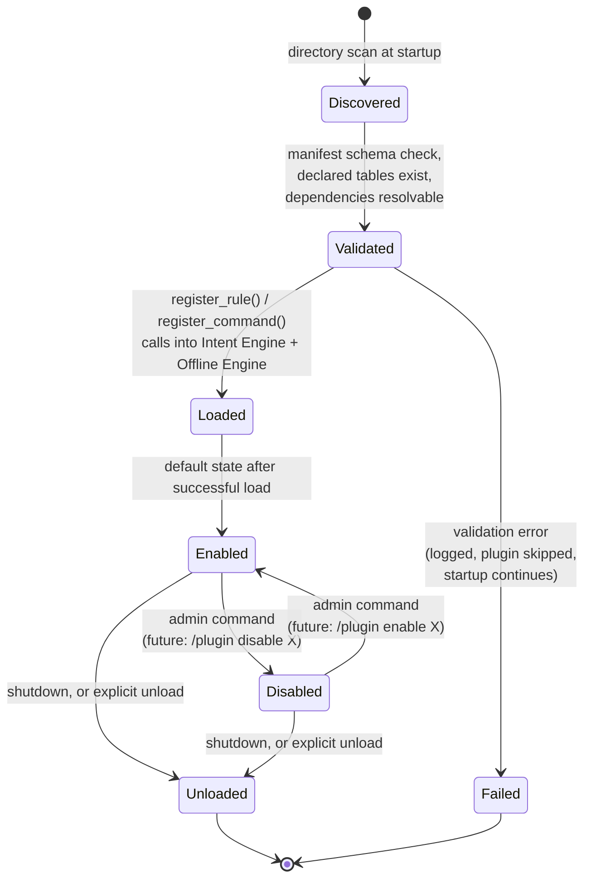

# Plugin System — Design Specification

**Part of:** `DESIGN_SPEC_v14_AUTONOMOUS_CORE.md`. Documentation only.
**Addresses:** `ENGINEERING_AUDIT.md` finding J1/J3 — `main.py` is a
confirmed 5,300+ line, ~90-handler god-file where every new command means
editing that one file, growing it further. This is a genuinely new
subsystem; nothing in the current codebase does this today.

---

## Why this exists

Every feature BAKA has ever shipped — tasks, habits, goals, projects,
wellness nudges, AI analytics — was added by editing `main.py` directly.
`CHANGELOG.md`'s own version history shows this pattern holding for 13
major versions straight, and `ENGINEERING_AUDIT.md`'s CQ-1 finding
identifies the resulting cost precisely: `handle_message()` alone is 841
lines mixing menu handling, the 4-state state machine, the slashless-
command table, and AI-intent fallback, specifically *because* every new
command's matching logic gets added to the same function. The Plugin
System's job is to make "add a new capability" and "edit `main.py`" two
different, no-longer-coupled activities.

## Plugin discovery

A `plugins/` directory, each subdirectory a self-contained plugin:

```
plugins/
  projects/                    # example: today's Projects feature,
    manifest.yaml               # re-expressed as a plugin (see ADR-004
    handlers.py                  # for why Projects specifically is the
    __init__.py                  # proof-of-concept target)
  weather_reminders/            # a hypothetical future third-party plugin
    manifest.yaml
    handlers.py
```

Discovery is a directory scan at startup (`main()`'s existing startup
sequence, after `init_db()`/`instance_lock.acquire()` — see
`docs/telegram_integration.md` for where this slots into today's startup
order), not a dynamic/hot-reload mechanism — consistent with NFR-4 in the
master spec (bounded startup-time cost) and with the project's existing
preference for explicit, predictable startup (`instance_lock.py`'s own
design rationale: prefer things that are easy to reason about over clever
automatic behavior).

## Registration

Each plugin's `manifest.yaml` declares what it provides, read once at
discovery time:

```yaml
name: projects
version: 1.0.0
description: "Turn goals into tracked projects with materials and worklog"
intents:
  - name: project.need_materials
    tier: 1              # registers into the Intent Engine's Tier-1 pattern rules
    patterns: ["need {goal_id} {items}", "materials {goal_id} {items}"]
  - name: project.mark_acquired
    tier: 1
    patterns: ["got {name}", "have {name}"]
commands:
  - name: project
    handler: handlers.project_cmd
    aliases: [projects]
    offline: true          # never needs the AI Router -- see OFFLINE_ENGINE.md
permissions:
  - database.read: [goals, project_materials, project_worklog]
  - database.write: [project_materials, project_worklog]
dependencies: []            # other plugin names this one requires, if any
```

The Intent Engine's `RuleRegistry` (`INTENT_ENGINE.md`) and the Offline
Engine's command registry both expose a `register_*` extension point that
plugin loading calls into — plugins never edit either engine's source,
they call an API the engines already expose.

## Capabilities

A plugin declares, not infers, what it needs:

- **Intents/commands it provides** (above).
- **Database tables it reads/writes** — checked against `database.py`'s
  actual schema at load time; a plugin declaring a table that doesn't
  exist fails to load with a clear error, rather than failing at first
  use.
- **Whether it needs the AI Router** — an `offline: true`/`false` flag per
  command, feeding directly into `OFFLINE_ENGINE.md`'s inventory (a
  plugin's offline commands are automatically included in that inventory,
  not maintained separately).
- **Whether it needs admin permission** — mirrors the existing
  `admin_only` decorator pattern (`docs/telegram_integration.md`) exactly;
  a plugin command marked `admin_only: true` gets the same silent-denial
  behavior every built-in admin command already has, not a
  plugin-specific permission model that would behave inconsistently.

## Permissions

Two layers, both already precedented in the current codebase:

1. **User-level** (default) — every plugin command is scoped by
   `user_id` automatically, the same way every `database.py` function
   already enforces (`docs/database.md`'s "Data integrity patterns"). A
   plugin cannot opt out of this; it is not a permission a plugin
   requests, it is a property the Offline Engine enforces on every write
   regardless of which plugin issued it.
2. **Admin-level** (opt-in via manifest) — reuses `main.py`'s existing
   `admin_only` decorator and `admin_id.txt`-based single-owner lock
   (`docs/telegram_integration.md`) verbatim. No new admin model is
   introduced; a plugin cannot define its own notion of "admin."

**Explicitly not supported in v14:** a plugin requesting elevated database
access beyond what its manifest declares (no dynamic permission
escalation), and plugin-to-plugin direct calls that bypass the Offline
Engine (a plugin needing another plugin's data goes through the same
`database.py` functions any other caller would, respecting the same
scoping — plugins don't get a private back channel to each other).

## Lifecycle



A failed plugin does not prevent the bot from starting — matching the
project's existing tolerance for partial-availability at startup (e.g.
`database.py`'s `init_db()` already logs and continues past individual
migration failures, per `_safe_add_column()`'s design in the "Database
Hardening" sprint). One broken plugin should never be a single point of
failure for the whole bot.

## Dependency graph

Plugins may declare dependencies on other plugins (`dependencies:` in the
manifest). Loading order is a topological sort of the declared graph; a
cycle is a validation failure at discovery time (Validated → Failed in the
lifecycle diagram), not a runtime error. v14's built-in plugins (if any
are actually extracted per the master spec's Stage 5 proof-of-concept)
are expected to have no inter-dependencies — the Projects proof-of-concept
specifically was chosen for being self-contained (see ADR-004).

## Plugin loading

1. Discovery scans `plugins/`.
2. Each manifest is schema-validated.
3. Dependency graph is resolved (topological order).
4. In that order, each plugin's `handlers.py` is imported and its
   declared intents/commands are registered into the Intent Engine and
   Offline Engine via their extension points.
5. Any failure at steps 2-4 marks that plugin `Failed` and moves on.

## Plugin unloading

Supported at shutdown (clean interpreter exit, same `atexit`-based
discipline `instance_lock.py` already established for its own cleanup) and,
as a future extension, via an admin command at runtime — unloading
de-registers the plugin's rules/commands from the Intent Engine and
Offline Engine's registries. v14 does not require unloading to reclaim
memory perfectly (Python's own garbage collection handles that); it
requires unloading to stop the plugin's commands from matching, which is
a registry-removal operation, not a process-level concern.

## Plugin versioning

`manifest.yaml`'s `version` field follows semver. v14 does not build a
package registry or auto-update mechanism (out of scope, §Non-Goals) — a
plugin's version is metadata for compatibility checking (a future
dependency like `dependencies: [{name: projects, min_version: "1.2.0"}]`)
and for diagnostics (`/admin` or a future `/plugins` command listing
installed plugins and versions, extending the existing admin-panel
pattern), not a live update system.

## Why this design, not a heavier framework

Deliberately modeled on the *lightest* plugin architecture that satisfies
FR-5 (master spec) — a directory-scanned manifest + two registration
calls — rather than a full dependency-injection framework or a
setuptools-entry-points-based system. This is a direct consequence of the
project's own documented engineering values (`CLAUDE.md`: "Don't add
features, refactor, or introduce abstractions beyond what the task
requires"). A heavier framework would be easier to justify for a
plugin *marketplace* with many third-party authors; v14's actual, stated
need (§12 of the master spec) is first-party extensibility and a proof
of concept, which this design satisfies without over-building for a
future that may not materialize.
