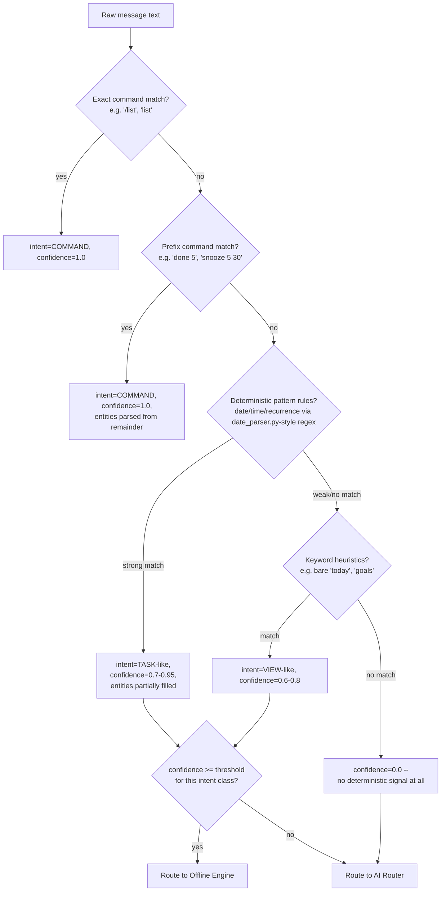

# Intent Engine — Design Specification

**Part of:** `DESIGN_SPEC_v14_AUTONOMOUS_CORE.md`. Documentation only.
**Replaces/formalizes:** `main.py`'s slashless-command table
(`_starts_with_handlers`/`_exact_handlers`), its keyword view-shortcuts,
and the deterministic-override role `date_parser.py` already plays against
the AI's date/time guesses (`ARCHITECTURE.md`'s message-lifecycle section).

---

## Implementation status (added post-Stage-1, v14.0)

**Stage 1 (this document's own scope — the tiered classifier, Shadow
Mode) has shipped**, in `core/intent/`. See `docs/adr/ADR-002-intent-engine.md`'s
"Implementation Note" for what was learned building it, and
[CHANGELOG.md](../../CHANGELOG.md) for the release entry. This document remains
the design record (not rewritten to match the implementation line-for-line)
— three deltas worth knowing if you're reading this design doc and the
real code side by side:

- **`ClassificationResult` (design) → `IntentResult` (shipped)**, and the
  field names differ: `tier_matched` → `tier`, `raw_matches` was dropped
  (each rule already returns its own `reasoning` string, which covers the
  same debugging need without a separate list), and `ambiguity` /
  `latency_ms` were added (justified in `core/intent/intent_types.py`'s
  docstring — `latency_ms` in particular because the Logging section
  below explicitly asked for a "Latency" log line).
- **Tier count**: this document describes Tiers 0-3; the shipped code has
  finer-grained sub-tiers within what this document calls "Tier 3" (regex)
  — an anchored whole-message greeting/small-talk check, evaluated
  *before* the date parser, and a separate unanchored help-phrasing check,
  evaluated after. See the ADR's Implementation Note for why (a real
  misclassification this design's own Tier-based philosophy predicts and
  was built to prevent, found once during Stage 1's test-writing).
- **Routing decisions** (`OFFLINE`/`AI_ROUTER`/`CLARIFY`, the "Execution
  pipeline" section below) are **not** implemented yet — Stage 1 is
  observation-only by design (`DESIGN_SPEC_v14_AUTONOMOUS_CORE.md` §11).
  `IntentEngine.classify()` returns a classification; nothing currently
  reads it to make a routing decision. That's Stage 2+.

---

## Why this exists

Today, classifying a message is split across three uncoordinated places in
`main.py`'s `handle_message()`: an exact/prefix string-match table, a
handful of hardcoded keyword checks for view requests, and — for
everything else — a full round-trip to `baka_brain.py`'s
`get_baka_response()`. There is no single place that says "here is how
confident we are that we understood this message" — confidence is
implicit in *which* branch happened to match, not a measured, comparable
number. That makes it impossible to answer questions like "how often does
BAKA actually need AI to understand a message?" without guessing, and it
means every new command's matching logic is bespoke, hand-written, and
easy to get subtly inconsistent with the others (this is exactly the kind
of drift `date_parser.py`'s own bug history — `CHANGELOG.md` v3.0/v3.1/v7.1,
plus the 3 bugs `tests/test_date_parser.py` found in Sprint "First
Automated Regression Test Suite" — shows can accumulate in ad-hoc pattern
matching over time).

The Intent Engine's job is narrow and disciplined: **given raw user text,
produce an intent, a confidence score, and extracted entities — using only
deterministic, offline logic — and never decide what to DO about it.**
Execution is the Offline Engine's or AI Router's job (`OFFLINE_ENGINE.md`,
`AI_ROUTER.md`).

## Intent classification pipeline



Every stage runs in order; the first stage that produces a confident match
short-circuits the rest. This mirrors — and makes explicit — the existing
precedence already implicit in `handle_message()` (exact/prefix table
checked before the keyword shortcuts, checked before falling through to
AI), so migrating existing behavior into this pipeline (§11 of the master
spec) is a reordering exercise, not new logic.

## Confidence scoring

A single float in `[0.0, 1.0]` per classification attempt, with fixed
bands rather than a learned/probabilistic model (deliberately — see ADR-002
for why a rule-based scorer was chosen over an ML classifier):

| Band | Meaning | Source |
|---|---|---|
| 1.0 | Exact or prefix command match | The command table itself — no ambiguity possible by construction |
| 0.85 – 0.95 | Strong deterministic pattern match with all required entities present | e.g. `date_parser.py`-style regex matched a date AND a time AND a recognizable recurrence phrase |
| 0.6 – 0.84 | Deterministic match but with a missing or ambiguous required field | e.g. today's "X baje" ambiguous-hour case (`date_parser.py`'s own `time_ambiguous` flag) — matched *something*, but needs either a clarifying re-prompt (state machine, not AI) or is confident enough to proceed with a sensible default |
| 0.3 – 0.59 | Weak keyword-only heuristic, no structured entity extraction | e.g. the message contains "remind" but nothing else recognizable |
| 0.0 – 0.29 | No deterministic signal | Free-form conversational text, or a pattern the rule set genuinely doesn't cover |

**Per-intent-class thresholds**, not one global cutoff — mirroring how
different commands already have different risk profiles today (a wrong
guess on a VIEW command is nearly free to undo; a wrong guess that
silently deletes something is not):

| Intent class | Threshold to execute via Offline Engine without AI or confirmation | Rationale |
|---|---|---|
| Read-only (VIEW, list, search) | 0.6 | Wrong guess costs nothing — worst case shows the wrong list, user asks again |
| Write, reversible (create task, snooze, pause) | 0.75 | Matches today's confirmation-flow precedent (`fmt.py`'s `confirm_box()` — BAKA already always confirms saves) |
| Write, destructive (delete, admin resets) | 0.95, AND always still shows a confirmation prompt regardless of score | No change from today's behavior — `main.py`'s admin resets already require typed confirmation phrases; the Intent Engine formalizes the *classification* step, it does not relax the existing safety gates |
| Ambiguous / below any threshold | n/a | Escalates to AI Router |

## Rule priority

Rules are organized into **priority tiers**, evaluated tier-by-tier (highest
first); within a tier, rules are evaluated in registration order and the
first match wins:

1. **Tier 0 — exact/prefix commands.** Registered by the command's own
   plugin manifest (`PLUGIN_SYSTEM.md`) or, for built-in commands, by the
   Offline Engine's own command registry. Always confidence 1.0.
2. **Tier 1 — structured pattern rules.** Date/time/recurrence parsing
   (directly reusing `date_parser.py`'s existing regex functions —
   `parse_date`, `parse_time`, `detect_recurrence` become Tier-1 rule
   sources verbatim, not reimplemented), deadline-phrase detection
   (today's `is_deadline` heuristic), multi-task detection
   (`might_have_multiple_tasks`).
3. **Tier 2 — keyword heuristics.** Bare view-shortcuts ("today", "week",
   "goals" with nothing else), and simple lexical signals ("remind",
   "delete", "forget") that hint at intent without fully resolving entities.
4. **Tier 3 — no match.** Falls through with confidence 0.0.

A rule in a lower tier never overrides a higher tier's match — this
prevents the class of bug the test suite found in `date_parser.py` (a
broad pattern like "noon" accidentally matching inside "afternoon")
from being able to silently reorder priority; tier assignment is an
explicit, reviewed decision per rule, not implicit in list order within a
single flat list the way today's `_vague_fixed` list was.

## AI fallback boundary

The Intent Engine escalates to the AI Router in exactly three cases:

1. **Confidence below the intent class's threshold** (see table above).
2. **The intent is inherently AI-shaped** — `/think`, `/plan` (generation,
   not the view), `/breakdown`, `/suggest`, vision (photo messages),
   image/video generation. These are Tier-0-*recognized* (the command
   itself matches deterministically, confidence 1.0 that the user wants
   "planning" or "thinking") but the *content* of the response requires
   generation, so Tier 0 for these intents routes directly to the AI
   Router rather than the Offline Engine — this is a deliberate, named
   exception, not a confidence-score failure (see `OFFLINE_ENGINE.md`'s
   "commands that never work offline" table for the authoritative list).
3. **Explicit escalation request** — a future extensibility hook (§12 of
   the master spec) for a plugin or the state machine to say "I matched
   deterministically, but I want a second opinion" (not used by any v14
   built-in rule, reserved for future use).

Everything else executes via the Offline Engine with zero AI involvement.

## Parser architecture

```
IntentEngine
├── RuleRegistry              # ordered list of (tier, rule) pairs
│   ├── CommandRules           # Tier 0 — sourced from Offline Engine's
│   │                            command registry + Plugin System manifests
│   ├── PatternRules           # Tier 1 — wraps date_parser.py's existing
│   │                            functions as rule sources, unchanged
│   └── KeywordRules           # Tier 2 — simple lexical heuristics
├── classify(text, context) -> ClassificationResult
│     ClassificationResult:
│       intent: str
│       confidence: float
│       entities: dict
│       tier_matched: int
│       raw_matches: list        # for debugging/logging — mirrors
│                                  debug_system.py's existing /trace concept
└── register_rule(tier, rule)     # extension point for Plugin System
```

`context` carries the same kind of state `conversation_state.py` already
tracks (current state — idle/gathering/confirming/editing — and partial
data from a prior turn), so the Intent Engine can classify a reply to "what
time?" correctly without re-deriving the whole conversation from scratch —
this is a direct continuation of how `handle_message()`'s `gathering`
branch already works today, just moved behind a formal interface.

## Execution pipeline (Intent Engine's own scope)

1. Receive `(text, user_id, context)`.
2. Run Tier 0 → Tier 1 → Tier 2 in order, stopping at first confident
   match per tier's own internal rules.
3. Compute the final `ClassificationResult`.
4. Compare confidence against the matched intent class's threshold.
5. Return a routing decision: `OFFLINE`, `AI_ROUTER`, or `CLARIFY`
   (re-prompt via the state machine — e.g. today's AM/PM disambiguation
   buttons for an ambiguous "baje" time).
6. Log the classification (intent, confidence, tier, routing decision) —
   this is the data source that would let a future pass answer "how much
   of BAKA's traffic actually needs AI," informing whether Stage 4/5 of
   the master spec's migration (additional AI providers) is even worth
   prioritizing over further Offline Engine coverage.

The Intent Engine does not call `database.py`, `scheduler.py`, or any AI
provider directly. It is a pure function of `(text, context) →
ClassificationResult`, which is what makes NFR-6 (offline-testable)
achievable — every rule can be unit tested exactly the way
`tests/test_date_parser.py` already tests `date_parser.py`'s functions
today, with no mocking required.

## Natural language examples

Grounded in phrasing this project's own `TEST_CHECKLIST.md` and
`debug_system.py`'s `SELFTEST_MESSAGES` already exercise:

| Input | Tier matched | Intent | Confidence | Routing |
|---|---|---|---|---|
| `/list` | 0 | COMMAND(list) | 1.0 | Offline |
| `done 5` | 0 | COMMAND(done) | 1.0 | Offline |
| `Kal subah 8 baje gym yaad dila dena` | 1 | TASK | 0.9 (date+time+title all resolved) | Offline |
| `3 baje meeting hai` | 1 | TASK | 0.65 (time ambiguous — AM/PM unresolved) | CLARIFY (same AM/PM button flow as today) |
| `Go to gym every day at 6 AM` | 1 | HABIT | 0.9 (recurrence + time resolved) | Offline |
| `today` | 2 | VIEW(today) | 0.7 | Offline (read-only threshold is lower) |
| `remind me` (nothing else) | 2 | TASK (weak) | 0.35 | AI Router (below the 0.75 write threshold) |
| `think what should I focus on today?` | 0 | THINK | 1.0 (command matched) | AI Router (named exception — THINK is inherently AI-shaped) |
| `How are you?` | 3 | none | 0.0 | AI Router |
| `Bhai kal 9 baje meeting yaad dila dena` | 1 | TASK | 0.9 | Offline — Hindi/Hinglish support is a Tier-1 property (reusing `date_parser.py`'s existing bilingual regex), not something that requires AI |

## Error recovery

- **Ambiguous match (0.6–0.84 band on a write intent):** routes to
  `CLARIFY`, using the *existing* state-machine mechanics
  (`conversation_state.py`'s `gathering`/`confirming` states) — no new
  state-machine primitive is needed for this, see `STATE_MACHINE.md`.
- **Rule conflict (two Tier-1 rules both claim a match):** resolved by
  rule registration order within the tier, logged as a warning at
  classification time so conflicting rules are visible during development
  rather than silently shadowing each other (directly addressing the root
  cause of the "noon"-inside-"afternoon" class of bug found in
  `date_parser.py`'s original flat pattern list).
  **Note on precedence syntax:** the rule *definitions* in
  `PatternRules`/`KeywordRules` should themselves use word-boundary-safe
  matching (`\b...\b`) by construction — this is a design requirement for
  every Tier-1/Tier-2 rule, not an afterthought, precisely because the
  test suite found this exact class of bug once already
  (`CHANGELOG.md` v13.3's "First Automated Regression Test Suite" entry).
- **No match at all (confidence 0.0):** always routes to AI Router — the
  Intent Engine never guesses when it has no deterministic signal; this is
  the safety property that makes FR-8 ("an AI outage must never break an
  Offline-Engine-eligible command") true, since by construction anything
  the Intent Engine confidently recognizes never depended on AI being up.
- **AI Router itself unavailable (all providers down):** out of the Intent
  Engine's scope — see `AI_ROUTER.md`'s fallback chain — but the Intent
  Engine's own classification and any partial entity extraction it already
  performed are still returned to the caller, so the user-facing error can
  say "I understood you wanted to create a task, but I can't reach any AI
  provider to fill in the details" rather than a generic failure.
